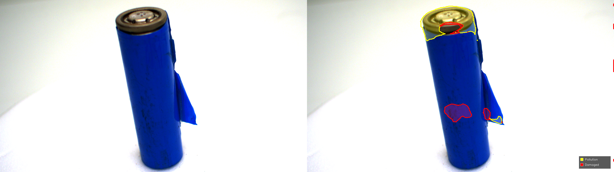

# 06. C# 데모 구현 회고 — DeepLabV3+ ONNX 추론 파이프라인

> 프로젝트: `csharp_demo/BatteryDemo/`
> 환경: Windows 11, Visual Studio 2022, .NET 8.0, Microsoft.ML.OnnxRuntime.Gpu 1.18+, OpenCvSharp4
> 입력: `models/battery_deeplab_v1.onnx` (DeepLabV3+ fine-tuned, 3-class semantic segmentation)
> 출력: 클래스별 결함 영역 시각화(overlay) + Before/After 비교 이미지

---

## 1. 개요

`05_onnx_deployment_journey.md` 에서 검증된 ONNX 모델을 실제 C# 비전 검사 애플리케이션에 통합하는 단계입니다. **Python 추론 환경과 동일한 latency·정확도를 C# 런타임에서 재현하는 것**을 목표로 하였습니다.

본 단계에서는 단순 모델 이식이 아닌, 현장 비전 검사 장비에서 안정적으로 동작 가능한 추론 구조를 구축하는 것을 목표로 하였습니다.

| 설계 기준 | 채택 사유 |
|---|---|
| Python → C# 추론 결과 일치성 | 운영 환경 이관 시 정합성 보장이 최우선 요구사항으로 판단 |
| GPU 가속 + CPU 폴백 | 현장 장비 사양 편차에 대비한 가용성 확보 |
| 배치 처리 + 통계 출력 | latency 변동성 검증을 통한 양산 적용 가능성 평가 |
| 외관색 무관 결함 시각화 | 배터리 종류별 외관 색상 차이에 대응하는 검사기 UX 확보 |

---

## 2. 구현 결정 — 의사결정 기록

### 2-1. CUDA EP 등록 실패 시 예외 분기 처리

ORT의 CUDA Execution Provider 등록 단계에서 두 가지 상이한 예외가 발생할 수 있음을 확인하였습니다.

| 예외 유형 | 원인 | 담당자 조치 |
|---|---|---|
| `EntryPointNotFoundException` | `Microsoft.ML.OnnxRuntime` CPU 전용 패키지만 설치된 상태 | `Microsoft.ML.OnnxRuntime.Gpu` NuGet 패키지로 교체 |
| `OnnxRuntimeException` | GPU 패키지는 정상이나 cuDNN/cuBLAS DLL 미발견 | DLL 경로 등록 또는 NVIDIA 패키지 재설치 |

운영 환경에서 두 경우의 진단·복구 절차가 다르므로, `Inferencer.cs` 내에서 **각각의 예외를 분리 포착하여 명확한 안내 메시지를 출력**하도록 구현하였습니다. 또한 두 케이스 모두에서 CPU 폴백을 보장하여 **데모 자체는 항상 동작**하는 구조로 설계하였습니다.

### 2-2. NVIDIA DLL 경로 등록 방식 선택

Python 환경에서 확립한 해결책(`os.add_dll_directory()` + `PATH` prepend 병용)을 C#에 이식하는 과정에서 두 가지 API 후보를 비교하였습니다.

| API | 동작 특성 | 채택 여부 |
|---|---|---|
| `SetDllDirectory` (kernel32) | **마지막 호출만 유효** — 다중 경로 등록 불가 | 미채택 |
| `Environment.SetEnvironmentVariable("PATH", ...)` | 기존 PATH 앞에 prepend, 다중 경로 누적 가능 | ✓ 채택 |

cuDNN, cuBLAS, cuda_runtime 의 세 경로를 모두 등록해야 하는 요구사항을 고려할 때 **단일 호출만 유효한 `SetDllDirectory` 방식은 부적합**한 것으로 판단하였습니다. 또한 PATH 환경변수 prepend 방식은 OS의 표준 DLL 탐색 메커니즘을 활용하므로, 향후 OS 버전 변경에도 안정적으로 동작할 것으로 평가하였습니다.

### 2-3. 후처리 시각화 방식 — Contour + Soft Fill 병용

초기에는 **클래스 색상으로 영역을 채우는 단순 fill 방식**을 적용하였으나, 다음 한계를 확인하였습니다.

- 노란색 배터리 외관에 노란색 Pollution fill 적용 시 결함 영역의 시인성이 저하되는 현상이 발생하였습니다.
- 불투명 fill은 원본 텍스처를 가려 **육안 재확인 시 결함 형상 판단이 어려움**으로 평가되었습니다.

이에 따라 다음 2단 시각화 방식을 채택하였습니다.

1. **약한 fill (alpha 0.25)** — 결함 영역의 대략적 위치를 색상으로 인지
2. **두꺼운 외곽선 (contour, thickness 3)** — 외관색에 관계없이 결함 경계를 선명하게 표시

이 방식은 양산 검사 환경에서 **담당자가 결함 위치와 경계를 보다 직관적으로 확인할 수 있도록 구성**하였습니다.

### 2-4. 마스크 리사이즈 보간 방식

ORT 출력(513×513 logits) → 원본 해상도 마스크 변환 과정에서 보간 방식 선택이 필요하였습니다.

| 보간 방식 | 적용 결과 | 채택 여부 |
|---|---|---|
| `InterpolationFlags.Linear` | 클래스 인덱스(0/1/2)가 중간값(0.5, 1.5 등)으로 보간되어 **잘못된 클래스 픽셀** 생성 | 미채택 |
| `InterpolationFlags.Nearest` | 클래스 인덱스 무결성 보존 | ✓ 채택 |

세그멘테이션 마스크는 연속값이 아닌 **이산 클래스 라벨**이므로 클래스 인덱스 무결성을 유지하기 위해 Nearest Neighbor 방식이 가장 적합하다고 판단하였습니다.

---

## 3. 트러블슈팅 기록

### 3-1. logits 길이 미스매치 — Runtime 무결성 검증

**현상**: 학습 모델 변경 시 클래스 수가 달라질 가능성에 대비하여 사전 검증 로직 필요성을 인지하였습니다.

**조치**: `Postprocessor.BuildOverlay()` 진입 시점에 다음 검증을 추가하였습니다.

```csharp
int expected = NumClasses * Size * Size;
if (logits.Length != expected)
    throw new InvalidOperationException(
        $"logits 길이 {logits.Length} ≠ 기대값 {expected} ...");
```

해당 검증을 통해 **모델·코드 간 클래스 수 불일치 발생 시 즉시 예외**가 발생하므로, 모델과 코드 간 클래스 수 불일치 상황을 조기에 탐지할 수 있을 것으로 판단하였습니다.

### 3-2. 워밍업 미수행 시 초기 latency 왜곡

**현상**: ORT GPU 추론의 첫 1~2회 호출에서 CUDA 컨텍스트 초기화·커널 컴파일에 의해 latency 가 비정상적으로 높게 측정되는 현상이 발생하였습니다.

**조치**: 첫 이미지를 기준으로 **5회 워밍업**을 선행한 후, **이미지별 20회 평균** 으로 latency 를 측정하도록 변경하였습니다.

```csharp
// 워밍업 5회 (첫 이미지 사용)
for (int i = 0; i < 5; i++) inf.Run(warmupData);

// 본 측정 — 20회 평균
for (int i = 0; i < N; i++) logits = inf.Run(inputData);
double avgInferMs = sw.ElapsedMilliseconds / (double)N;
```

이를 통해 **양산 환경에서의 정상 상태 latency** 를 측정할 수 있음을 확인하였습니다.

### 3-3. 배치 latency 변동성 검증

**판단 근거**: 단일 측정값만으로는 양산 환경 적용 가능성을 판단하기 어렵다고 평가하였습니다.

**조치**: 배치 종료 후 다음 통계를 자동 출력하도록 구현하였습니다.

```
=== 배치 결과 (3장) ===
평균 latency : XXX.X ms/image
min / max    : XXX.X / XXX.X ms
변동폭       : XX.X ms (가이드 합격선: ≤ 10 ms)
```

변동폭 합격선(≤ 10 ms)은 **양산 라인의 tact-time 변동 허용 한계**를 고려하여 설정하였습니다. 해당 임계값을 만족하지 못할 경우 담당자가 즉시 인지하여 환경 점검(GPU 점유, 메모리 fragment 등)을 수행할 수 있도록 의도하였습니다.

### 3-4. 입력 인자 처리의 유연성 확보

**요구사항**: 데모 시연 시 단일 이미지 검증, 폴더 일괄 처리, 인자 미입력 시 기본 폴더 처리의 3가지 모드를 모두 지원할 필요성을 확인하였습니다.

**구현**: `ResolveImagePaths()` 함수에서 인자 유형을 자동 판별하도록 처리하였습니다.

| 인자 형태 | 동작 |
|---|---|
| 인자 없음 | `test_images/` 기본 폴더 일괄 처리 |
| 파일 경로 | 단일 이미지 처리 |
| 폴더 경로 | 해당 폴더 일괄 처리 |

이를 통해 **시연 시점에 검증 대상을 유연하게 선택**할 수 있도록 하였습니다.

---

## 4. 시각화 컴포넌트 — 담당자 UX 관점 설계

### 4-1. Before/After 가로 합성 출력

검사 결과의 신뢰성을 높이기 위해 **원본 이미지와 결함 표시 결과를 가로로 합성한 비교 이미지**(`before_after_001.png` ...)를 별도로 저장하도록 구현하였습니다.

`Cv2.HConcat(original, overlay, beforeAfter)` 원본 이미지와 결과 이미지를 동시에 비교할 수 있도록 구성하여, 담당자가 모델 판단 결과를 빠르게 검증할 수 있도록 하였습니다.

**실제 추론 결과 (3장 배치)**


> 좌측: 원본 입력 / 우측: 추론 결과(노란 외곽선 = Pollution, 빨간 외곽선 = Damaged)


### 4-2. 범례(Legend) 자동 삽입

화면 우측 하단에 **클래스별 색상-라벨 범례**를 반투명 배경으로 자동 삽입하도록 구현하였습니다.

| 클래스 | 색상 | 의미 |
|---|---|---|
| Pollution | 노랑 | 오염 결함 |
| Damaged | 빨강 | 손상 결함 |

범례 삽입을 통해 **현장 담당자가 별도 가이드 없이도 검사 결과를 즉시 해석**할 수 있는 환경을 조성하고자 하였습니다.

### 4-3. 결함 픽셀 통계 로그

후처리 단계에서 클래스별 결함 픽셀 수·점유율을 콘솔에 출력하도록 구현하였습니다.

```
[mask] Pollution(노랑): XXX,XXX px (X.XX%)
[mask] Damaged(빨강) : XXX,XXX px (X.XX%)
```

해당 로그는 **개별 이미지의 결함 심각도를 정량적으로 비교**할 수 있는 기준으로 활용 가능할 것으로 평가하였습니다.

---

## 5. 핵심 정리

| 항목 | 구현 결과 |
|---|---|
| Python ↔ C# 추론 일치성 | DeepLabV3+ 동일 가중치 사용, 전처리 파이프라인(BGR→RGB, resize, ImageNet normalize, NCHW) 동일 적용 |
| GPU 가속 폴백 전략 | CUDA EP 등록 실패 2종 케이스(`EntryPointNotFoundException` / `OnnxRuntimeException`)를 분리 포착하여 CPU 폴백 보장 |
| Latency 안정성 검증 | 워밍업 5회 + 이미지별 20회 평균 + 배치 변동폭 자동 출력 |
| 외관색 무관 시각화 | Soft fill(alpha 0.25) + 두꺼운 외곽선(contour, thickness 3) 병용 |
| 마스크 정합성 | argmax 후 Nearest Neighbor 리사이즈로 클래스 인덱스 무결성 보존 |
| 담당자 UX | Before/After 가로 합성 + 범례 자동 삽입 + 클래스별 픽셀 통계 로그 |

---

## 6. 양산 적용을 위한 후속 과제

본 데모는 양산 환경 탑재 가능성 검증을 위한 PoC 수준으로 판단하며, 실제 라인 적용 시 다음 항목의 추가 검토가 필요할 것으로 평가합니다.

| 후속 과제 | 검토 사유 |
|---|---|
| 다중 카메라 입력 동시 처리 | 양산 라인의 다면 검사 요구사항 대응 |
| 검사 결과 DB 적재 | 결함 이력 추적 및 통계 분석 기반 마련 |
| 임계값(threshold) 외부 설정화 | 라인별 검사 기준 차이를 코드 수정 없이 반영 |
| ONNX Runtime TensorRT EP 적용 | 추가 latency 단축 여지 확인 필요 (현재 CUDA EP 기준 약 5.2× 가속 달성) |
| 모델 가중치 외부 배포 채널 확립 | GitHub 100MB 한계 대응 (현재 약 155 MB) — Hugging Face Hub 또는 S3 활용 검토 |

---

## 7. 면접 시 활용 포인트

본 문서에서 강조하고자 하는 역량은 다음과 같습니다.

1. **Python 환경에서 검증된 모델을 실제 현장 언어(C#)로 이관하는 통합 역량** — ONNX 표준을 통한 프레임워크 독립성 확보
2. **단순 동작이 아닌 운영 환경 가용성을 고려한 설계** — 폴백 전략, latency 안정성 검증, 담당자 UX 측면의 시각화
3. **Silent failure 대응** — `EntryPointNotFoundException` / `OnnxRuntimeException` 분리 포착, 마스크 리사이즈 보간 검증, logits 길이 사전 검증 등 **운영 환경에서의 오검출 및 시각화 오류 가능성을 최소화**하기 위한 방어적 설계
4. **재현 가능성 확보** — 워밍업 + 평균 측정 + 변동폭 출력을 통해 단일 측정값에 의존하지 않는 정량 평가 체계 구축

> 본 데모는 **"학습된 모델을 현장 장비에 안정적으로 탑재하고 운영 가능한 상태로 만드는 역량"** 을 검증하기 위한 프로젝트입니다.
