# 0. 환경 점검 + 경로 정의

### 0-1. 환경 & 경로


```python
from pathlib import Path
import numpy as np
import pandas as pd
import cv2
import matplotlib.pyplot as plt

PROJECT  = Path(r'D:\02.study\part4_wj\Battery\Battery_Project')
ONNX_OUT = PROJECT / 'models' / 'battery_deeplab_v1.onnx'
IMG_DIR  = PROJECT / 'battery_image'
MASK_DIR = PROJECT / 'battery_mask'
SPLIT    = PROJECT / 'battery_splits' / 'test_meta.csv'
DEMO_DIR = PROJECT / 'notebooks_docs' / 'Demo_Image'
REPORT   = PROJECT / 'docs' / '06_verification_report.md'

for p in [ONNX_OUT, IMG_DIR, MASK_DIR, SPLIT]:
    assert p.exists(), f'경로 없음: {p}'
DEMO_DIR.mkdir(parents=True, exist_ok=True)

# 클래스 정의 — 학습 인덱스와 1:1 일치 (data_card.md §3)
CLASS_NAMES = ['background', 'Pollution', 'Damaged']
NUM_CLASSES = 3
# 시각화 팔레트 (RGB) — Pollution=노랑, Damaged=빨강
PALETTE = np.array([[0, 0, 0], [255, 255, 0], [255, 0, 0]], dtype=np.uint8)

print('경로 확인 완료')
```

    경로 확인 완료
    

## 1. test 셋 로드 + 분포 확인

모집단 `test_meta.csv`로 검증 대상 38장을 불러오고, clean / pollution / both 분포를 출력합니다.

### 1-1. test 셋 로드


```python
df = pd.read_csv(SPLIT)                       # 컬럼: name, label
df['img']  = df['name'].apply(lambda n: IMG_DIR  / f'{n}.png')
df['mask'] = df['name'].apply(lambda n: MASK_DIR / f'{n}.png')

# 파일 존재 검증 — 하나라도 없으면 즉시 멈춤
missing = df[~df['img'].apply(Path.exists) | ~df['mask'].apply(Path.exists)]
assert missing.empty, f'누락 파일:\n{missing["name"].tolist()}'

print(f'test 셋: {len(df)}장')
print(df['label'].value_counts())

ok_df = df[df['label'] == 'clean'].reset_index(drop=True)       # 정상품 24
defect_df = df[df['label'].isin(['pollution', 'both'])].reset_index(drop=True)  # 결함 14
print(f'\n정상품(OK): {len(ok_df)}장   결함: {len(defect_df)}장')
```

    test 셋: 38장
    label
    clean        24
    both          7
    pollution     7
    Name: count, dtype: int64
    
    정상품(OK): 24장   결함: 14장
    

## 2. ONNX 추론 함수

추론 엔진을 구성하기 위해

C# `Postprocessor.cs`와 **완전히 동일한 전처리**로 추론하는 함수를 만듭니다.

### 2-1. (GPU 사용 시) NVIDIA 런타임 DLL 경로 등록


```python
import os
NVIDIA_BIN = PROJECT / 'venv_battery' / 'Lib' / 'site-packages' / 'nvidia'
for sub in ['cudnn', 'cuda_runtime', 'cublas']:
    d = str(NVIDIA_BIN / sub / 'bin')
    if Path(d).is_dir():
        os.add_dll_directory(d)
        os.environ['PATH'] = d + os.pathsep + os.environ['PATH']
        print(f'CUDA DLL dir added: {d}')
```

    CUDA DLL dir added: D:\02.study\part4_wj\Battery\Battery_Project\venv_battery\Lib\site-packages\nvidia\cudnn\bin
    CUDA DLL dir added: D:\02.study\part4_wj\Battery\Battery_Project\venv_battery\Lib\site-packages\nvidia\cuda_runtime\bin
    CUDA DLL dir added: D:\02.study\part4_wj\Battery\Battery_Project\venv_battery\Lib\site-packages\nvidia\cublas\bin
    

### 2-2. ORT 세션 생성


```python
import onnxruntime as ort

sess = ort.InferenceSession(
    str(ONNX_OUT),
    providers=['CUDAExecutionProvider', 'CPUExecutionProvider'],
)
INPUT_NAME  = sess.get_inputs()[0].name
OUTPUT_NAME = sess.get_outputs()[0].name
print(f'입력: {INPUT_NAME}  출력: {OUTPUT_NAME}')
print(f'실제 사용 provider: {sess.get_providers()}')
```

    입력: input  출력: logits
    실제 사용 provider: ['CUDAExecutionProvider', 'CPUExecutionProvider']
    

> `CUDAExecutionProvider`가 결과로 나왔으니 GPU 를 사용하고 있는 상태임을 확인하였습니다.

### 2-3. 전처리 + 추론 함수


```python
SIZE = 513
MEAN = np.array([0.485, 0.456, 0.406], dtype=np.float32)
STD  = np.array([0.229, 0.224, 0.225], dtype=np.float32)

def _softmax(logits, axis=0):
    e = np.exp(logits - logits.max(axis=axis, keepdims=True))
    return e / e.sum(axis=axis, keepdims=True)

def predict(img_path):
    """원본 이미지 → (클래스 마스크[H,W], 클래스 확률[3,H,W]). 모두 원본 해상도."""
    bgr = cv2.imread(str(img_path), cv2.IMREAD_COLOR)
    if bgr is None:
        raise FileNotFoundError(img_path)
    H, W = bgr.shape[:2]

    rgb = cv2.cvtColor(bgr, cv2.COLOR_BGR2RGB)
    resized = cv2.resize(rgb, (SIZE, SIZE), interpolation=cv2.INTER_LINEAR)
    x = resized.astype(np.float32) / 255.0
    x = (x - MEAN) / STD                          # ImageNet 정규화
    x = x.transpose(2, 0, 1)[None]                # HWC → NCHW

    logits = sess.run([OUTPUT_NAME], {INPUT_NAME: x})[0][0]   # (3,513,513)
    prob513 = _softmax(logits, axis=0)
    cls513  = logits.argmax(0).astype(np.uint8)

    # 원본 해상도 복원 — 클래스는 nearest(인덱스 보존), 확률은 linear
    cls_full  = cv2.resize(cls513, (W, H), interpolation=cv2.INTER_NEAREST)
    prob_full = np.stack([cv2.resize(prob513[c], (W, H), interpolation=cv2.INTER_LINEAR) for c in range(NUM_CLASSES)], axis=0)
    
    return cls_full, prob_full

# 동작 확인 — 결함 1장
_cls, _prob = predict(defect_df.loc[0, 'img'])
print(f'예측 마스크 shape={_cls.shape}, 클래스값={np.unique(_cls)}')
```

    예측 마스크 shape=(1080, 1920), 클래스값=[0 1 2]
    

이미지 한 장을 입력받아 AI 모델(DeepLab)을 통해 결함 부위를 찾아내고, 그 결과를 원래 이미지 크기로 되돌려주는 전체 과정입니다.

1. 전처리 (Preprocessing)
    * cv2.resize(rgb, (513, 513)): 모델이 학습할 때 사용한 크기인 (513x513) 으로 사진을 리사이징합니다.
    * x / 255.0: 0~255 사이의 픽셀 값을 0~1 사이로 정규화합니다.
    * MEAN, STD 정규화: ImageNet 데이터셋의 평균을 빼고 표준편차로 나눠,<br/> 채널별 분포를 학습 할때와 동일하게 맞춥니다.

    * transpose(2, 0, 1): 이미지 형식을 [높이, 너비, 채널]에서 AI 모델이 좋아하는 [채널, 높이, 너비] 순서로 바꿉니다.

2. 추론 (Inference)
    * `sess.run()` : onnxruntime GPU 세션에서 모델을 실제로 돌립니다.
    * logits : 모델의 출력값입니다. 0번 (배경) , 1번 (오염) , 2번 (손상) 클래스에 대한 점수가 들어있습니다.
    * _softmax : 점수를 0~1 사이의 확률로 변환합니다.
    * argmax(0) : 3개의 점수 중 가장 높은 점수를 가진 클래스의 번호를 선택하여 마스크를 만듭니다.

3. 후처리 (Post-processing)
    opencv로 
    * INTER_NEAREST : 클래스 번호(0,1,2)가 적힌 마스크를 키울 때 사용합니다. 중간값이 생기지 않게 가장 가까운 정수값을 그대로 유지하며 크기를 키웁니다.
    * INTER_LINEAR : 확률값은 소수점이므로 부드럽게 크기를 키우는 선형 보간법을 사용합니다.

  > 참고: cv2.resize에는 INTER_NEAREST / INTER_LINEAR / INTER_CUBIC / INTER_LANCZOS4 등이 있습니다.<br/>
  > 본 후처리는 클래스 마스크는 INTER_NEAREST, 확률 맵은 INTER_LINEAR를 사용했습니다.
  > CUBIC·LANCZOS4는 더 매끄러운 결과를 주지만 비용이 크고, 본 후처리에는 불필요하므로 가벼운 조합을 사용했습니다.

## 3. DL 정상품 과검 검증

학습에 쓰이지 않은 **정상품 24장**을 추론합니다.

정답 마스크가 전부 background인 이미지에서 **모델이 결함 픽셀을 얼마나 잘못 잡는지(과검)** 를 측정합니다.

### 3-1. 정상품 과검 측정


```python
MIN_DEFECT_AREA = 100   # 이 픽셀 수 미만은 노이즈로 보고 과검에서 제외 (EDA Pollution 중앙값 139px)
TOTAL_PX = 1920 * 1080

rows = []
for _, r in ok_df.iterrows():
    cls, _ = predict(r['img'])
    poll_px = int((cls == 1).sum())
    dmg_px  = int((cls == 2).sum())
    defect_px = poll_px + dmg_px
    rows.append({'name': r['name'], 'Pollution_px': poll_px,
                 'Damaged_px': dmg_px, 'defect_px': defect_px,
                 'overkill': defect_px >= MIN_DEFECT_AREA})

ok_res = pd.DataFrame(rows)
n_overkill = int(ok_res['overkill'].sum())
overkill_rate = n_overkill / len(ok_res)

print(f'정상품 {len(ok_res)}장 중 과검 {n_overkill}장  (과검율 {overkill_rate*100:.1f}%)')
print(f'정상품 평균 오검 픽셀: {ok_res["defect_px"].mean():.0f} px '
      f'(전체 {TOTAL_PX:,}px 대비 {ok_res["defect_px"].mean()/(TOTAL_PX)*100:.3f}%)')
print('\n과검 발생 이미지 (defect_px 큰 순 상위 5):')
print(ok_res.sort_values('defect_px', ascending=False).head())
```

    정상품 24장 중 과검 24장  (과검율 100.0%)
    정상품 평균 오검 픽셀: 6831 px (전체 2,073,600px 대비 0.329%)
    
    과검 발생 이미지 (defect_px 큰 순 상위 5):
                                 name  Pollution_px  Damaged_px  defect_px  \
    21  RGB_cell_cylindrical_1154_284          7875        8807      16682   
    11  RGB_cell_cylindrical_1156_249          6928        6914      13842   
    22  RGB_cell_cylindrical_1155_099          9276        3856      13132   
    19  RGB_cell_cylindrical_1017_241          9722        2574      12296   
    10  RGB_cell_cylindrical_1156_267          4098        7438      11536   
    
        overkill  
    21      True  
    11      True  
    22      True  
    19      True  
    10      True  
    

### 3-2. 후처리 적용 후 과검 재측정

3-1의 raw 출력은 픽셀 단위 분류기 특성상 노이즈가 섞여 과검율 100%로 나왔습니다.

**① morphological opening** 으로 점 노이즈를 지우고,

**② connected components 의 최소 면적 필터** 로 작은 블롭을 제거한 뒤 다시 측정합니다.

### 3-2-1. 후처리 함수 정의 (morphology + 면적 필터)


```python
# 후처리 하이퍼파라미터 (튜닝 포인트)
KERNEL_SIZE = 3       # opening 커널 크기 — 클수록 더 공격적으로 노이즈 제거
MIN_AREA    = 500     # 결함으로 인정할 최소 블롭 면적(px)

KERNEL = cv2.getStructuringElement(cv2.MORPH_ELLIPSE, (KERNEL_SIZE, KERNEL_SIZE))

def postprocess(cls, min_area=MIN_AREA, kernel=KERNEL):
    """
    raw 클래스 마스크 → 정제된 클래스 마스크.
    1) 클래스별 이진 마스크로 분리
    2) morphological opening 으로 점 노이즈 제거
    3) connected components 후 min_area 미만 블롭 제거
    """
    cleaned = np.zeros_like(cls)
    for c in [1, 2]:                                          # background(0) 제외
        bin_mask = (cls == c).astype(np.uint8)
        opened   = cv2.morphologyEx(bin_mask, cv2.MORPH_OPEN, kernel)
        n, labels, stats, _ = cv2.connectedComponentsWithStats(opened, connectivity=8)
        for i in range(1, n):                                 # 0번은 배경
            if stats[i, cv2.CC_STAT_AREA] >= min_area:
                cleaned[labels == i] = c
    return cleaned

# 동작 확인 — 결함 1장
_cls, _ = predict(defect_df.loc[0, 'img'])
_pp = postprocess(_cls)
print(f'raw 결함 픽셀:  {int((_cls > 0).sum()):>7d}')
print(f'후처리 후:     {int((_pp  > 0).sum()):>7d}')
```

    raw 결함 픽셀:    81510
    후처리 후:       79073
    

### 3-2-2. 정상품 24장에 적용 + 재측정 


```python
TOTAL_PX = 1920 * 1080

rows = []
for _, r in ok_df.iterrows():
    cls, _ = predict(r['img'])
    cls_pp = postprocess(cls)
    poll_px = int((cls_pp == 1).sum())
    dmg_px  = int((cls_pp == 2).sum())
    defect_px = poll_px + dmg_px
    rows.append({'name': r['name'], 'Pollution_px': poll_px,
                 'Damaged_px': dmg_px, 'defect_px': defect_px,
                 'overkill': (poll_px + dmg_px) >0,
                 })

ok_pp = pd.DataFrame(rows)
n_over = int(ok_pp['overkill'].sum())
n_over_rate = n_over / len(ok_pp)
mean_px = ok_pp['defect_px'].mean()


print(f'정상품 {len(ok_pp)}장 중 과검 {n_over}장  (과검율 {n_over_rate*100:.1f}%)')
print(f'정상품 평균 오검 픽셀: {mean_px:.0f} px '
      f'(전체 {TOTAL_PX:,}px 대비 {mean_px/TOTAL_PX*100:.3f}%)')
print('\n과검 발생 이미지 (defect_px 큰 순 상위 5):')
print(ok_pp[ok_pp['overkill']].sort_values('defect_px', ascending=False).head())
```

    정상품 24장 중 과검 23장  (과검율 95.8%)
    정상품 평균 오검 픽셀: 5978 px (전체 2,073,600px 대비 0.288%)
    
    과검 발생 이미지 (defect_px 큰 순 상위 5):
                                 name  Pollution_px  Damaged_px  defect_px  \
    21  RGB_cell_cylindrical_1154_284          7368        8213      15581   
    11  RGB_cell_cylindrical_1156_249          6605        6845      13450   
    22  RGB_cell_cylindrical_1155_099          8850        3712      12562   
    19  RGB_cell_cylindrical_1017_241          8921        2153      11074   
    3   RGB_cell_cylindrical_1156_275          1243        9043      10286   
    
        overkill  
    21      True  
    11      True  
    22      True  
    19      True  
    3       True  
    

숫자가 거의 안 움직였다는 건 "노이즈가 작은 점들이 아니라 덩치 큰 false positive 블롭"이라는 뜻입니다.

오검 픽셀이 ~6000px 가 그대로 남아있고, 상위 5장의 픽셀 수도 거의 그대로(16682 → 15581 등)입니다.

`MIN_AREA=500`
으로는 못 잡는 큰 덩어리들이 남아 있다는 신호로 보입니다.

단순 Threshold 조정보다는 실제 False Positive 발생 위치를 우선 확인하겠습니다.

### 3-2-3. 워스트 1장 시각화


```python
# 가장 과검이 심한 1장을 골라 raw vs 후처리 결과를 비교
worst = ok_pp.sort_values('defect_px', ascending=False).iloc[0]['name']
img_path = IMG_DIR / f'{worst}.png'

# 한글 깨짐 마이너스 부호 깨짐 방지
plt.rcParams['font.family'] = 'Malgun Gothic'
plt.rcParams['axes.unicode_minus'] = False

img = cv2.cvtColor(cv2.imread(str(img_path)), cv2.COLOR_BGR2RGB)
cls_raw, _ = predict(img_path)
cls_pp     = postprocess(cls_raw)

overlay_raw = img.copy()
overlay_pp  = img.copy()
overlay_raw[cls_raw == 1] = (255, 255, 0)   # Pollution → 노랑
overlay_raw[cls_raw == 2] = (255, 0,   0)   # Damaged   → 빨강
overlay_pp [cls_pp  == 1] = (255, 255, 0)
overlay_pp [cls_pp  == 2] = (255, 0,   0)

fig, ax = plt.subplots(1, 3, figsize=(18, 6))
ax[0].imshow(img);          ax[0].set_title(f'Origin: {worst}')
ax[1].imshow(overlay_raw);  ax[1].set_title('raw Previed')
ax[2].imshow(overlay_pp);   ax[2].set_title(f'후처리 (MIN_AREA={MIN_AREA})')
for a in ax: a.axis('off')
plt.tight_layout()
plt.show()
```


    
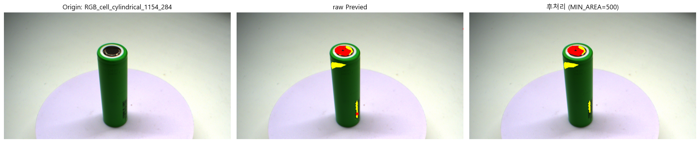
    


### 3-2-4. 블롭 크기 분포 확인


```python
from collections import Counter

ok_blob_sizes = []
for _, r in ok_df.iterrows():
    cls, _ = predict(r['img'])
    cls_pp = postprocess(cls)
    for c in [1, 2]:
        bin_m = (cls_pp == c).astype(np.uint8)
        n, _, stats, _ = cv2.connectedComponentsWithStats(bin_m, connectivity=8)
        for i in range(1, n):
            ok_blob_sizes.append(stats[i, cv2.CC_STAT_AREA])

# 결함 이미지의 진짜 결함 블롭 크기도 같이
defect_blob_sizes = []
for _, r in defect_df.iterrows():
    msk = cv2.imread(str(r['mask']), cv2.IMREAD_GRAYSCALE)
    for c in [1, 2]:
        bin_m = (msk == c).astype(np.uint8)
        n, _, stats, _ = cv2.connectedComponentsWithStats(bin_m, connectivity=8)
        for i in range(1, n):
            defect_blob_sizes.append(stats[i, cv2.CC_STAT_AREA])

print('정상품 false positive 블롭 크기 분포:')
print(pd.Series(ok_blob_sizes).describe())
print('\n결함 GT 블롭 크기 분포:')
print(pd.Series(defect_blob_sizes).describe())
```

    정상품 false positive 블롭 크기 분포:
    count      57.000000
    mean     2517.228070
    std      1936.402316
    min       525.000000
    25%       953.000000
    50%      2161.000000
    75%      3336.000000
    max      9043.000000
    dtype: float64
    
    결함 GT 블롭 크기 분포:
    count       201.000000
    mean       1829.238806
    std        8900.632200
    min           5.000000
    25%          37.000000
    50%         188.000000
    75%         768.000000
    max      120001.000000
    dtype: float64
    

GT 블롭 분포를 통해서 문제를 확인하였습니다.

  정상품 FP   :  min  525, 25%  953, 50% 2161, 75% 3336, max  9043
  결함 GT    :  min    5, 25%   37, 50%  188, 75%  768, max 120001

결함 블롭의 75%가 768 px 이하입니다. 정상품  FP 최소값(525px) 보다 결함 GT 중위값(188px)이 작았습니다.

면접 필터 튜닝이 아닌 다른 방식으로 확인하였습니다.

`confidence threshold` 확인 도입

- 모델의 확신도로 확인하겠습니다.

predict() 반환값 prob_full[3,H,W] 으로 활용합니다.

구조적 오인(캡/림)은 모델이 보통 확신도가 낮았습니다.(0.4~0.7).

### 3-2-5. postprocess_v2 확인


```python
def postprocess_v2(cls, prob, min_conf=0.7, min_area=200, kernel=KERNEL):
    """
    cls  : (H,W) 클래스 마스크
    prob : (3,H,W) softmax 확률
    1) (해당 클래스로 예측 ∧ 그 클래스 확률 >= min_conf) 만 통과
    2) morphological opening
    3) 면적 필터 (이제 낮춰도 됨 — 작은 진짜 결함 살리기)
    """
    cleaned = np.zeros_like(cls)
    for c in [1, 2]:
        bin_mask = ((cls == c) & (prob[c] >= min_conf)).astype(np.uint8)
        opened   = cv2.morphologyEx(bin_mask, cv2.MORPH_OPEN, kernel)
        n, labels, stats, _ = cv2.connectedComponentsWithStats(opened, connectivity=8)
        for i in range(1, n):
            if stats[i, cv2.CC_STAT_AREA] >= min_area:
                cleaned[labels == i] = c
    return cleaned
```


```python
rows = []
for _, r in ok_df.iterrows():
    cls, prob = predict(r['img'])
    cls_pp = postprocess_v2(cls, prob)          # ← v2 호출 (prob 사용)
    poll_px = int((cls_pp == 1).sum())
    dmg_px  = int((cls_pp == 2).sum())
    defect_px = poll_px + dmg_px
    rows.append({'name': r['name'], 'Pollution_px': poll_px,
                 'Damaged_px': dmg_px, 'defect_px': defect_px,
                 'overkill': (poll_px + dmg_px) >0,
                 })

ok_pp = pd.DataFrame(rows)
n_over = int(ok_pp['overkill'].sum())
n_over_rate = n_over / len(ok_pp)
mean_px = ok_pp['defect_px'].mean()


print(f'정상품 {len(ok_pp)}장 중 과검 {n_over}장  (과검율 {n_over_rate*100:.1f}%)')
print(f'정상품 평균 오검 픽셀: {mean_px:.0f} px '
      f'(전체 {TOTAL_PX:,}px 대비 {mean_px/TOTAL_PX*100:.3f}%)')
print('\n과검 발생 이미지 (defect_px 큰 순 상위 5):')
print(ok_pp[ok_pp['overkill']].sort_values('defect_px', ascending=False).head())
```

    정상품 24장 중 과검 13장  (과검율 54.2%)
    정상품 평균 오검 픽셀: 582 px (전체 2,073,600px 대비 0.028%)
    
    과검 발생 이미지 (defect_px 큰 순 상위 5):
                                 name  Pollution_px  Damaged_px  defect_px  \
    11  RGB_cell_cylindrical_1156_249          1608        1226       2834   
    19  RGB_cell_cylindrical_1017_241          1767           0       1767   
    6   RGB_cell_cylindrical_0954_143          1739           0       1739   
    23  RGB_cell_cylindrical_1154_187          1732           0       1732   
    20  RGB_cell_cylindrical_0996_020          1548           0       1548   
    
        overkill  
    11      True  
    19      True  
    6       True  
    23      True  
    20      True  
    

### 3-2-6. 과검 발생 이미지 육안 확인

v2 후처리 후에도 과검으로 남은 정상품 13장을 origin vs overlay로 비교합니다.

FP가 **일관된 위치(캡·림 등 구조물)** 에서 나오는지, **산발적**으로 나오는지 확인하여 재학습이 필요한지 / 후처리·ROI로 해결되는지 판단합니다.


```python
# 과검으로 남은 정상품 전체를 defect_px 큰 순으로 origin vs overlay 비교
over_names = (ok_pp[ok_pp['overkill']]
              .sort_values('defect_px', ascending=False)['name'].tolist())
print(f'과검 {len(over_names)}장 시각화')

n = len(over_names)
fig, axes = plt.subplots(n, 2, figsize=(14, 4 * n))
if n == 1:
    axes = axes[None, :]

for row, name in enumerate(over_names):
    p = IMG_DIR / f'{name}.png'
    img = cv2.cvtColor(cv2.imread(str(p)), cv2.COLOR_BGR2RGB)
    cls, prob = predict(p)
    cls_pp = postprocess_v2(cls, prob)

    overlay = img.copy()
    overlay[cls_pp == 1] = (255, 255, 0)   # Pollution → 노랑
    overlay[cls_pp == 2] = (255, 0,   0)   # Damaged   → 빨강

    poll = int((cls_pp == 1).sum())
    dmg  = int((cls_pp == 2).sum())

    axes[row, 0].imshow(img)
    axes[row, 0].set_title(f'{name}  (origin)')
    axes[row, 1].imshow(overlay)
    axes[row, 1].set_title(f'과검 overlay  P={poll}px  D={dmg}px')
    for a in axes[row]:
        a.axis('off')

plt.tight_layout()
plt.show()
```

    과검 13장 시각화
    


    
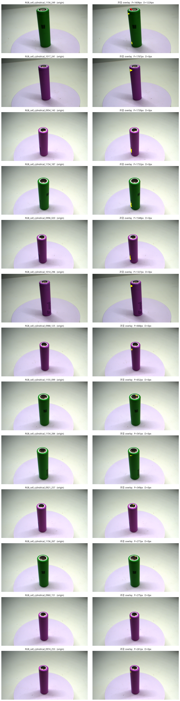
    


육안 검사 하며 정확히 확인하기 위해 확대 분석을 진행하였습니다.


```python
over_names = (ok_pp[ok_pp['overkill']]
                .sort_values('defect_px', ascending=False)['name'].tolist())

for name in over_names:
    p = IMG_DIR / f'{name}.png'
    img = cv2.cvtColor(cv2.imread(str(p)), cv2.COLOR_BGR2RGB)
    cls, prob = predict(p)
    cls_pp = postprocess_v2(cls, prob)

    fp = (cls_pp > 0).astype(np.uint8)
    nlab, labels, stats, _ = cv2.connectedComponentsWithStats(fp, connectivity=8)
    if nlab <= 1:
        continue
    big = 1 + int(np.argmax(stats[1:, cv2.CC_STAT_AREA]))   # 가장 큰 FP 블롭
    x, y, w, h, area = stats[big]

    m = 80                                                   # 확대 여백
    y0, y1 = max(0, y - m), min(img.shape[0], y + h + m)
    x0, x1 = max(0, x - m), min(img.shape[1], x + w + m)

    crop     = img[y0:y1, x0:x1]
    crop_cls = cls_pp[y0:y1, x0:x1]
    conf_map = np.where(cls_pp > 0, prob.max(0), 0)[y0:y1, x0:x1]

    overlay = crop.copy()
    overlay[crop_cls == 1] = (255, 255, 0)
    overlay[crop_cls == 2] = (255, 0,   0)

    conf_on_fp = prob.max(0)[cls_pp > 0]
    conf_txt = f'FP 확신도 평균 {conf_on_fp.mean():.2f} (min {conf_on_fp.min():.2f})'

    fig, ax = plt.subplots(1, 3, figsize=(15, 5))
    ax[0].imshow(crop);    ax[0].set_title(f'{name}\n최대 FP블롭 {area}px @ ({x},{y})')
    ax[1].imshow(overlay); ax[1].set_title(conf_txt)
    im = ax[2].imshow(conf_map, cmap='jet', vmin=0.7, vmax=1.0)
    ax[2].set_title('FP 확신도 맵')
    for a in ax:
        a.axis('off')
    plt.colorbar(im, ax=ax[2], fraction=0.046)
    plt.tight_layout()
    plt.show()
```


    
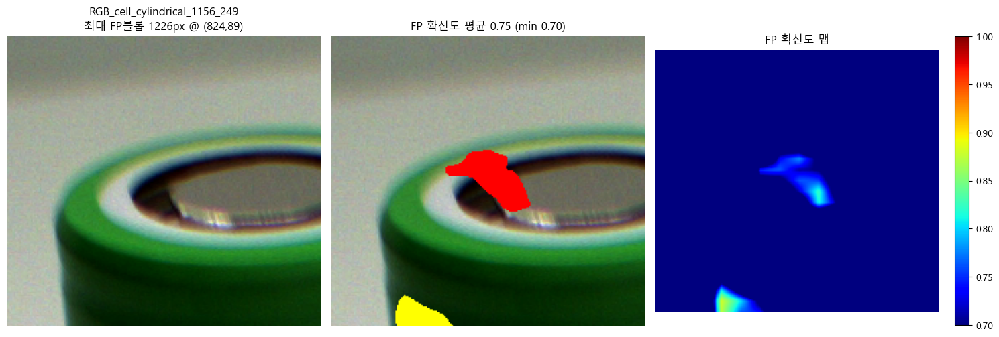
    


    
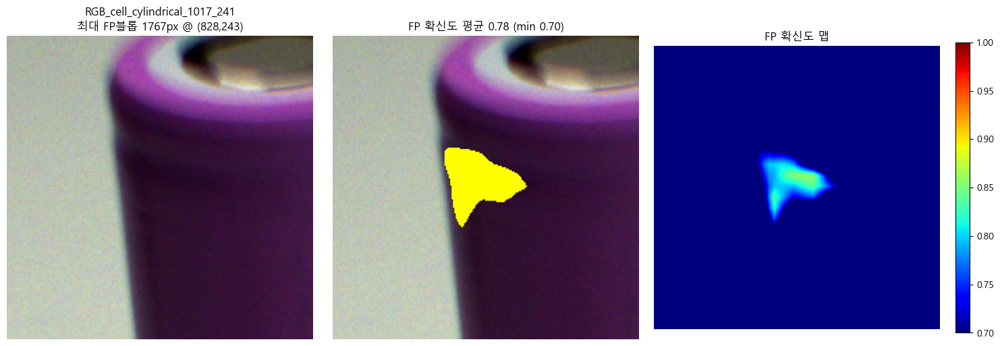
    


    
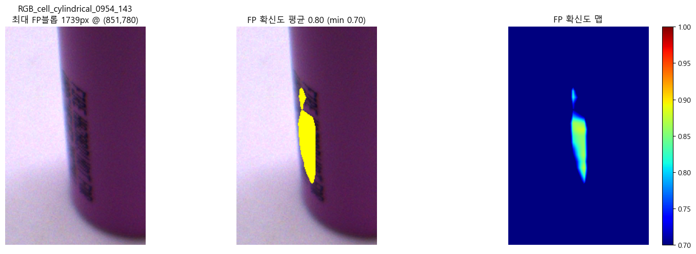
    


    
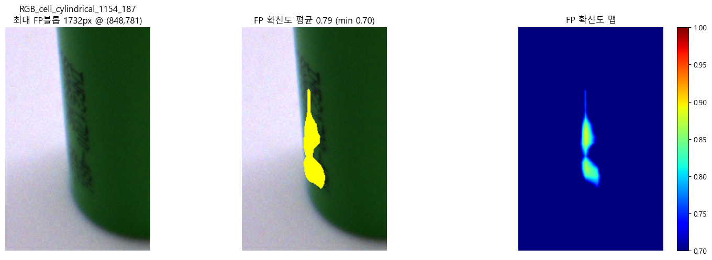
    


    
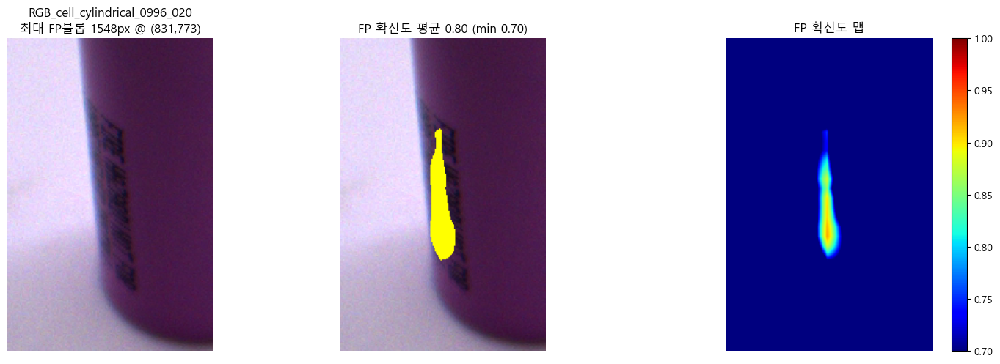
    


    
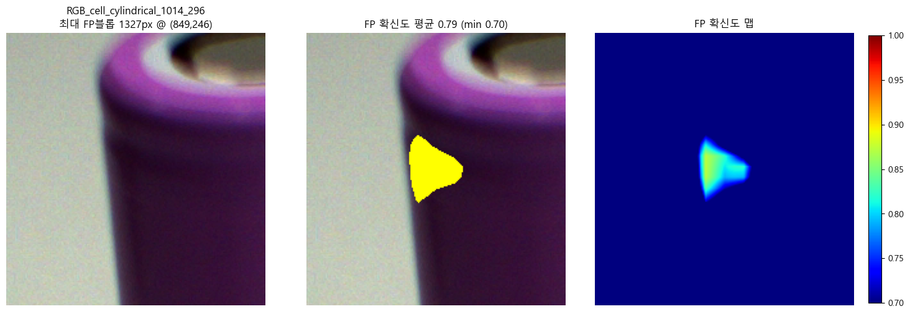
    


    
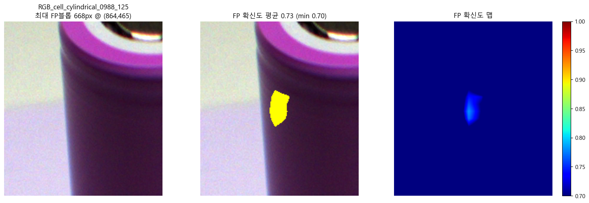
    


    
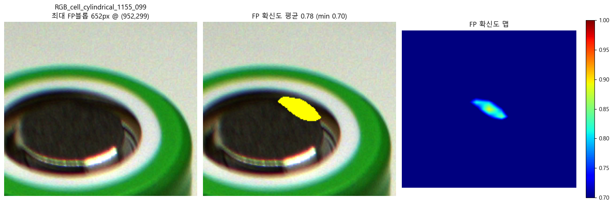
    


    
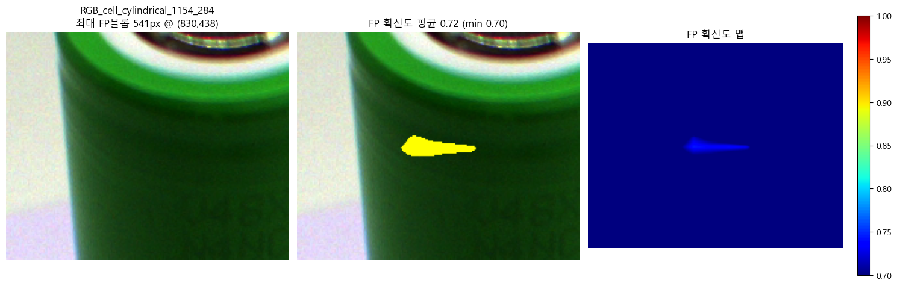
    


    
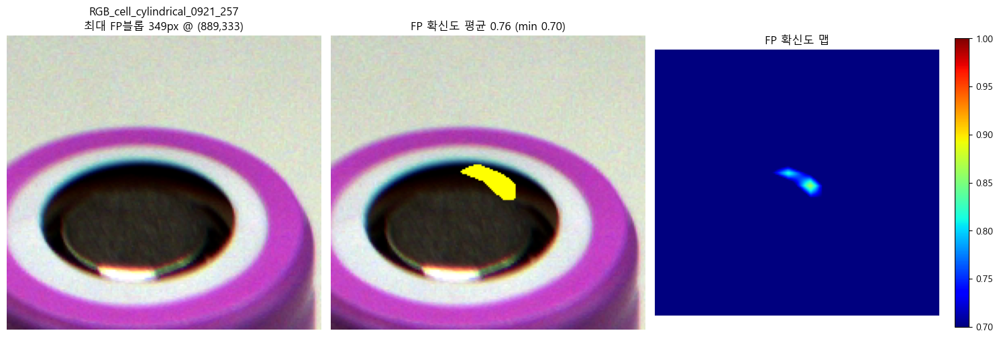
    


    
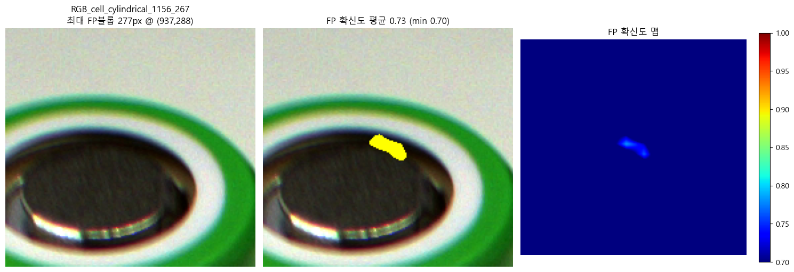
    


    
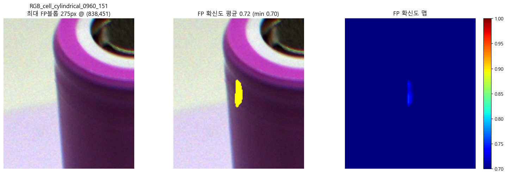
    


    
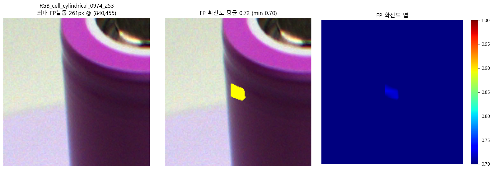
    


### 3-2-8 — 확신도 분리 검증

진짜 결함 TP vs 과검 FP — 확신도 분포 직접 비교하겠습니다.

confidence(확신도)가 '진짜 결함'과 '과검'을 분리할 수 있는지 확인하겠습니다.


```python
tp_conf, fp_conf = [], []

# 결함 이미지: 모델 예측 ∧ GT 결함 = TP 픽셀의 확신도
for _, r in defect_df.iterrows():
    cls, prob = predict(r['img'])
    gt = cv2.imread(str(r['mask']), cv2.IMREAD_GRAYSCALE)
    conf = prob.max(0)
    tp_conf.extend(conf[(cls > 0) & (gt > 0)].tolist())

# 정상품 이미지: 후처리(min_conf=0.7) 후 남은 FP 블롭의 확신도
for _, r in ok_df.iterrows():
    cls, prob = predict(r['img'])
    conf = prob.max(0)
    fp_mask = postprocess_v2(cls, prob, min_conf=0.7) > 0
    fp_conf.extend(conf[fp_mask].tolist())

tp_conf, fp_conf = np.array(tp_conf), np.array(fp_conf)
desc = lambda a: {k: round(float(v), 3) for k, v in pd.Series(a)
                .describe()[['mean', '25%', '50%', '75%', 'max']].items()}
print('진짜 결함 TP 확신도:', desc(tp_conf))
print('과검   FP 확신도:', desc(fp_conf))

plt.figure(figsize=(9, 4))
plt.hist(tp_conf, bins=40, range=(0, 1), density=True, alpha=0.6,
        color='tab:blue', label=f'진짜 결함 TP (n={len(tp_conf):,})')
plt.hist(fp_conf, bins=40, range=(0, 1), density=True, alpha=0.6,
        color='tab:red',  label=f'과검 FP (n={len(fp_conf):,})')
plt.axvline(0.70, color='gray', ls='--', label='현재 0.70')
plt.xlabel('confidence'); plt.ylabel('density')
plt.title('진짜 결함 vs 과검 — 확신도 분포가 갈리는가?')
plt.legend(); plt.tight_layout()
plt.show()
```

    진짜 결함 TP 확신도: {'mean': 0.758, '25%': 0.612, '50%': 0.806, '75%': 0.918, 'max': 0.985}
    과검   FP 확신도: {'mean': 0.771, '25%': 0.726, '50%': 0.76, '75%': 0.811, 'max': 0.92}
    


    
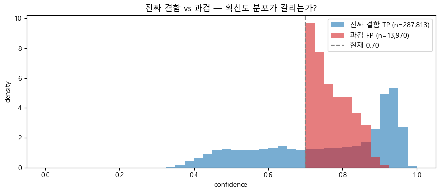
    


### 3-2-9 어느 결함이 누락되는지까지 표시


```python
ok_cache = [predict(r['img']) for _, r in ok_df.iterrows()]
def_cache = []
for _, r in defect_df.iterrows():
    cls, prob = predict(r['img'])
    gt = cv2.imread(str(r['mask']), cv2.IMREAD_GRAYSCALE)
    def_cache.append((r['name'], cls, prob, gt))

def evaluate(min_conf):
    n_over, over_px = 0, []
    for cls, prob in ok_cache:
        pp = postprocess_v2(cls, prob, min_conf=min_conf)
        px = int((pp > 0).sum())
        over_px.append(px)
        if px > 0:
            n_over += 1
    n_det, pix_recall, missed = 0, [], []
    for name, cls, prob, gt in def_cache:
        pp = postprocess_v2(cls, prob, min_conf=min_conf)
        inter = int(((pp > 0) & (gt > 0)).sum())
        gt_px = int((gt > 0).sum())
        if inter > 0:
            n_det += 1
        else:
            missed.append(name)
        pix_recall.append(inter / gt_px if gt_px else 0.0)
    return n_over, float(np.mean(over_px)), n_det, float(np.mean(pix_recall)), missed

print(f'{"min_conf":>8} | {"과검":>9} {"과검율":>7} {"평균FP":>8} | '
    f'{"결함검출":>9} {"검출율":>7} {"픽셀recall":>9} | 미검 이미지')
print('-' * 95)
for mc in [0.70, 0.80, 0.85, 0.90, 0.92, 0.95, 0.97]:
    n_over, mean_px, n_det, pr, missed = evaluate(mc)
    miss_txt = '없음' if not missed else ', '.join(m[-8:] for m in missed)
    print(f'{mc:>8.2f} | {n_over:>3}/{len(ok_cache)}장 {n_over/len(ok_cache)*100:>6.1f}% '
        f'{mean_px:>8.0f} | {n_det:>3}/{len(def_cache)}장 {n_det/len(def_cache)*100:>6.1f}% '
        f'{pr*100:>8.1f}% | {miss_txt}')
```

    min_conf |        과검     과검율     평균FP |      결함검출     검출율  픽셀recall | 미검 이미지
    -----------------------------------------------------------------------------------------------
        0.70 |  13/24장   54.2%      582 |  14/14장  100.0%     44.1% | 없음
        0.80 |   7/24장   29.2%      168 |  13/14장   92.9%     36.3% | 0781_050
        0.85 |   2/24장    8.3%       30 |  13/14장   92.9%     29.9% | 0781_050
        0.90 |   0/24장    0.0%        0 |  12/14장   85.7%     20.0% | 0781_050, 0731_017
        0.92 |   0/24장    0.0%        0 |  12/14장   85.7%     14.2% | 0781_050, 0731_017
        0.95 |   0/24장    0.0%        0 |   9/14장   64.3%      3.8% | 0781_050, 0731_017, 0731_240, 0891_174, 0821_134
        0.97 |   0/24장    0.0%        0 |   6/14장   42.9%      0.6% | 0916_293, 0781_050, 0731_017, 0731_240, 0832_265, 0891_174, 0791_220, 0821_134
    

스윕 표를 보면 숫자만으로는 결론이 안 나는 상태가 그대로 드러납니다:

- 0% 과검 + 100% 검출을 동시에 만족하는 min_conf가 없습니다.
- 0781_050은 min_conf=0.80에서 벌써 미검입니다. 이 결함은 모델이 확신도 0.8 미만으로만 잡는다는 뜻 — 아주
약하게 봅니다.
- 가장 느슨한 0.70에서도 픽셀 recall이 44.1%. "검출"해도 GT 결함의 절반 이하만 덮습니다.

여기서 두 가지 해석이 가능하고, 데이터를 안 보면 구분이 불가능합니다:

| 가능성 | 의미 | 결론 |
| :--- | :--- | :--- |
| 0781_050이 진짜 미세 결함 | 모델이 약한 결함에 약함 | 재학습/증강 검토 |
| 0781_050의 GT 라벨/마스크가 오류 | 미검이 아니라 라벨 노이즈 | 그 줄을 빼면 0.85가 답이 됨 |

만약 0781_050·0731_017이 라벨 오류라면 — min_conf=0.85에서 "진짜 검출율 100% + 과검 8.3%"가 되어 재학습 없이
끝납니다. 반대로 GT가 맞다면 재학습 근거가 확정됩니다. 그래서 GT 검증은 우회가 아니라 결론을 가르는
길목입니다.

추가로 — recall 44%는 모델이 덜 잡는 것일 수도 있지만, GT 마스크가 실제 결함보다 크게/엉뚱하게 그려진 것일
수도 있습니다. 이것도 눈으로 봐야 합니다.

### 3-2-10 GT 라벨·마스크 검증


```python
# (1) 결함 14장 GT 마스크 현황 — 비정상적으로 작거나 빈 마스크 탐지
print('결함 14장 GT 마스크 현황:')
for _, r in defect_df.iterrows():
    gt = cv2.imread(str(r['mask']), cv2.IMREAD_GRAYSCALE)
    print(f"  {r['name'][-8:]}  라벨={r['label']:<10} "
        f"Pollution={int((gt==1).sum()):>6}px  Damaged={int((gt==2).sum()):>6}px")

# (2) 미검·의심 이미지 확대 검증 (필요시 이름 추가 — 과검 OK 이미지도 가능)
audit_names = ['RGB_cell_cylindrical_0781_050',
                'RGB_cell_cylindrical_0731_017']

for name in audit_names:
    p   = IMG_DIR  / f'{name}.png'
    img = cv2.cvtColor(cv2.imread(str(p)), cv2.COLOR_BGR2RGB)
    gt  = cv2.imread(str(MASK_DIR / f'{name}.png'), cv2.IMREAD_GRAYSCALE)
    cls, prob = predict(p)
    conf = prob.max(0)

    lab = df.loc[df['name'] == name, 'label'].values
    lab = lab[0] if len(lab) else '(없음)'

    # GT 결함 영역으로 확대 (마스크가 비면 전체)
    ys, xs = np.where(gt > 0)
    if len(ys):
        m = 120
        y0, y1 = max(0, ys.min()-m), min(img.shape[0], ys.max()+m)
        x0, x1 = max(0, xs.min()-m), min(img.shape[1], xs.max()+m)
    else:
        y0, y1, x0, x1 = 0, img.shape[0], 0, img.shape[1]

    gt_ov = img.copy()
    gt_ov[gt == 1]  = (255, 255, 0); gt_ov[gt == 2]  = (255, 0, 0)
    pr_ov = img.copy()
    pr_ov[cls == 1] = (255, 255, 0); pr_ov[cls == 2] = (255, 0, 0)

    print(f'\n[{name}]  CSV라벨={lab}  '
        f'GT: Pollution={int((gt==1).sum())}px, Damaged={int((gt==2).sum())}px')

    fig, ax = plt.subplots(1, 4, figsize=(20, 5))
    ax[0].imshow(img[y0:y1, x0:x1]);   ax[0].set_title('원본 (GT영역 확대)')
    ax[1].imshow(gt_ov[y0:y1, x0:x1]); ax[1].set_title(f'GT 마스크 (라벨={lab})')
    ax[2].imshow(pr_ov[y0:y1, x0:x1]); ax[2].set_title('모델 예측 (raw argmax)')
    im = ax[3].imshow(conf[y0:y1, x0:x1], cmap='jet', vmin=0.3, vmax=1.0)
    ax[3].set_title('모델 확신도')
    for a in ax:
        a.axis('off')
    plt.colorbar(im, ax=ax[3], fraction=0.046)
    plt.tight_layout(); plt.show()
```

    결함 14장 GT 마스크 현황:
      0916_293  라벨=both       Pollution= 22294px  Damaged=  8897px
      0920_061  라벨=both       Pollution= 22480px  Damaged= 22676px
      0781_050  라벨=pollution  Pollution=   472px  Damaged=     0px
      0731_017  라벨=pollution  Pollution= 21508px  Damaged=     0px
      0913_223  라벨=pollution  Pollution=  7098px  Damaged=     0px
      0731_240  라벨=pollution  Pollution=  5797px  Damaged=     0px
      0917_121  라벨=both       Pollution= 11224px  Damaged= 34440px
      0748_080  라벨=pollution  Pollution=  5019px  Damaged=     0px
      0832_265  라벨=pollution  Pollution= 32241px  Damaged=     0px
      0891_174  라벨=both       Pollution= 17015px  Damaged=  3690px
      0791_220  라벨=both       Pollution=  2017px  Damaged=     7px
      0916_193  라벨=both       Pollution=131074px  Damaged=  9730px
      0851_267  라벨=both       Pollution=  7193px  Damaged=   230px
      0821_134  라벨=pollution  Pollution=  2575px  Damaged=     0px
    
    [RGB_cell_cylindrical_0781_050]  CSV라벨=pollution  GT: Pollution=472px, Damaged=0px
    


    
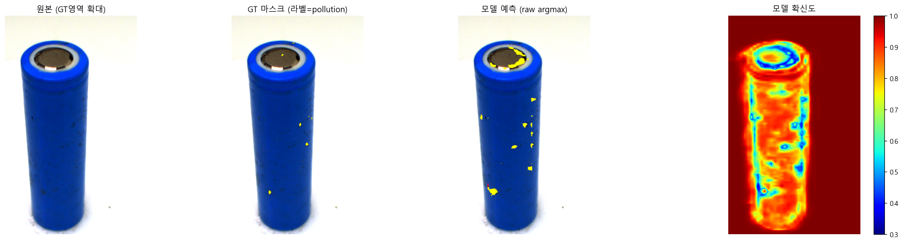
    


    
    [RGB_cell_cylindrical_0731_017]  CSV라벨=pollution  GT: Pollution=21508px, Damaged=0px
    


    
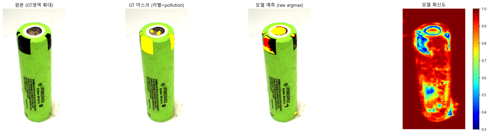
    


첫번째 이미지분석

- GT 472px는 14장 중 압도적으로 비정상입니다. 다음으로 작은 게 0791_220의 2017px, 중앙값은 7000px대 —
  472px는 다음 최소값의 1/4, 중앙값의 1/15 수준입니다.
- 위치가 캡 림(전극 캡) — 정상 구조물입니다.
- 원본 패널을 봐도 깨끗한 셀입니다. 모델이 여기서 확신도가 낮은 건 오히려 정상 동작입니다 (결함이 없으니까).

0.80·0.85의 유일한 미검이 0781_050이었습니다. 이게 GT 오류면 그 미검은 가짜 미검 → **0.85에서 진짜 검출율 100%**가 됩니다.


두번쨰 이미지 분석
GT 마스크는 정상이나 모델이 문제로 보입니다.

1. 덜 잡음(under-coverage) — 예측 영역이 GT보다 작습니다.
2. 클래스 혼동 — GT는 Pollution(노랑)인데 모델은 같은 자리를 Damaged(빨강) 로 예측했습니다.

확신도 맵을 보면 캡 영역이 0.7~0.85에 흩어져 있어서, min_conf를 0.9로 올리면 이 예측이 사라져 미검이 됩니다.
즉, 0731_017의 미검은 GT 오류가 아니라 진짜 모델 약점입니다 — 캡 오염에 자신이 없는 것.

표에서 추가로 의심되는 GT

요약 표에 또 하나 걸립니다:

 - 0791_220: 라벨=both 인데 Damaged=7px. 7px는 노이즈 수준입니다. "both"라면서 손상이 7px인 건 라벨-마스크 불일치 의심
 - audit_names에 추가해 확인하겠습니다.

 | 이미지 | GT 판정 | 의미 |
 | :--- | :--- | :--- |
 | 0781_050 | GT 오류 의심 | 미검 아님 → 제외 시 0.85에서 검출율 100% |
 | 0731_017 | GT 정상 | 진짜 모델 약점 (캡 오염 under-coverage) — 검증 리포트에 한계로 명시 |

### 3-2-11 GT 오류분 제외 후 스윕 재측정


```python
# 원본 해상도 육안 검증에서 'GT 오류'로 확정된 것만 기입
mislabeled = {'RGB_cell_cylindrical_0781_050'}   # 확인 후 0791_220 등 추가 가능

def_cache_clean = [t for t in def_cache if t[0] not in mislabeled]
print(f'결함셋: {len(def_cache)} → {len(def_cache_clean)}장 '
    f'(GT오류 {len(mislabeled)}장 제외)\n')

def evaluate_clean(min_conf):
    n_over, over_px = 0, []
    for cls, prob in ok_cache:
        pp = postprocess_v2(cls, prob, min_conf=min_conf)
        px = int((pp > 0).sum())
        over_px.append(px)
        if px > 0:
            n_over += 1
    n_det, missed = 0, []
    for name, cls, prob, gt in def_cache_clean:
        pp = postprocess_v2(cls, prob, min_conf=min_conf)
        if int(((pp > 0) & (gt > 0)).sum()) > 0:
            n_det += 1
        else:
            missed.append(name[-8:])
    return n_over, float(np.mean(over_px)), n_det, missed

print(f'{"min_conf":>8} | {"과검율":>7} {"평균FP":>8} | {"검출율":>7} | 미검')
print('-' * 58)
for mc in [0.70, 0.80, 0.85, 0.88, 0.90]:
    n_over, mean_px, n_det, missed = evaluate_clean(mc)
    print(f'{mc:>8.2f} | {n_over/len(ok_cache)*100:>6.1f}% {mean_px:>8.0f} | '
        f'{n_det/len(def_cache_clean)*100:>6.1f}% | {missed if missed else "없음"}')
```

    결함셋: 14 → 13장 (GT오류 1장 제외)
    
    min_conf |     과검율     평균FP |     검출율 | 미검
    ----------------------------------------------------------
        0.70 |   54.2%      582 |  100.0% | 없음
        0.80 |   29.2%      168 |  100.0% | 없음
        0.85 |    8.3%       30 |  100.0% | 없음
        0.88 |    0.0%        0 |   92.3% | ['0731_017']
        0.90 |    0.0%        0 |   92.3% | ['0731_017']
    

### 3-2-11 이미지 전수 육안 검증


```python
def audit(names, tag):
    print(f'\n========== {tag} : {len(names)}장 ==========')
    for name in names:
        p = IMG_DIR / f'{name}.png'
        img = cv2.cvtColor(cv2.imread(str(p)), cv2.COLOR_BGR2RGB)
        gt  = cv2.imread(str(MASK_DIR / f'{name}.png'), cv2.IMREAD_GRAYSCALE)
        cls, prob = predict(p)
        conf = prob.max(0)
        lab = df.loc[df['name'] == name, 'label'].values[0]

        # 확대 영역: GT 결함이 있으면 GT 기준, 없으면 모델 예측 기준
        ref = gt if (gt > 0).any() else (cls > 0).astype(np.uint8)
        ys, xs = np.where(ref > 0)
        if len(ys):
            m = 110
            y0, y1 = max(0, ys.min()-m), min(img.shape[0], ys.max()+m)
            x0, x1 = max(0, xs.min()-m), min(img.shape[1], xs.max()+m)
        else:
            y0, y1, x0, x1 = 0, img.shape[0], 0, img.shape[1]

        gt_ov = img.copy()
        gt_ov[gt == 1] = (255,255,0); gt_ov[gt == 2] = (255,0,0)
        pr_ov = img.copy()
        pr_ov[cls == 1] = (255,255,0); pr_ov[cls == 2] = (255,0,0)

        print(f"\n[{name}] 라벨={lab}  "
            f"GT: P={int((gt==1).sum())}px D={int((gt==2).sum())}px  "
            f"모델: P={int((cls==1).sum())}px D={int((cls==2).sum())}px")
        fig, ax = plt.subplots(1, 4, figsize=(22, 6))
        ax[0].imshow(img[y0:y1, x0:x1]);   ax[0].set_title('원본')
        ax[1].imshow(gt_ov[y0:y1, x0:x1]); ax[1].set_title('GT 마스크')
        ax[2].imshow(pr_ov[y0:y1, x0:x1]); ax[2].set_title('모델 예측')
        im = ax[3].imshow(conf[y0:y1, x0:x1], cmap='jet', vmin=0.3, vmax=1.0)
        ax[3].set_title('확신도')
        for a in ax:
            a.axis('off')
        plt.colorbar(im, ax=ax[3], fraction=0.046)
        plt.tight_layout()
        plt.show()
```


```python
# 결함 14장 GT 전수 검증
audit(defect_df['name'].tolist(), '결함 GT 검증')

# 정상품 과검(0.70 기준) 검증 — 진짜 깨끗한지 / 라벨 누락 결함인지
audit(ok_pp[ok_pp['overkill']]['name'].tolist(), '정상품 과검 검증')
```

    
    ========== 결함 GT 검증 : 14장 ==========
    
    [RGB_cell_cylindrical_0916_293] 라벨=both  GT: P=22294px D=8897px  모델: P=74727px D=6783px
    


    
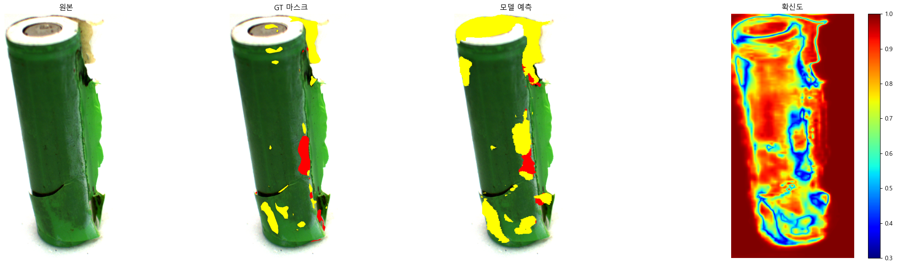
    


    
    [RGB_cell_cylindrical_0920_061] 라벨=both  GT: P=22480px D=22676px  모델: P=75479px D=17885px
    


    
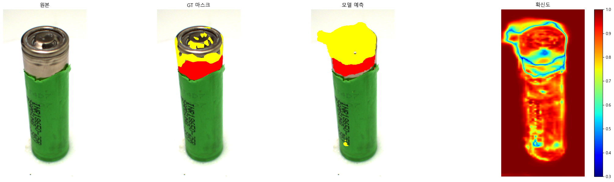
    


    
    [RGB_cell_cylindrical_0781_050] 라벨=pollution  GT: P=472px D=0px  모델: P=7867px D=68px
    


    
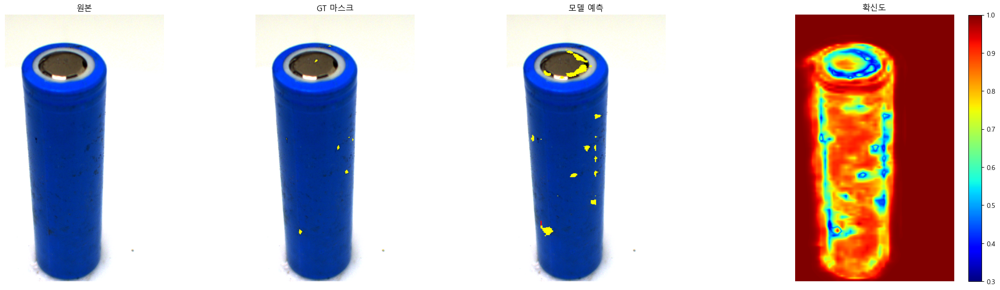
    


    
    [RGB_cell_cylindrical_0731_017] 라벨=pollution  GT: P=21508px D=0px  모델: P=15953px D=4509px
    


    
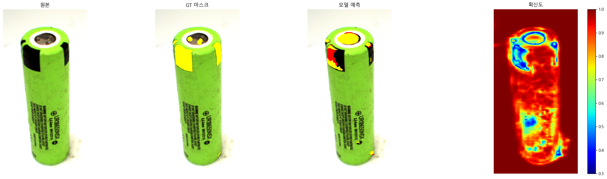
    


    
    [RGB_cell_cylindrical_0913_223] 라벨=pollution  GT: P=7098px D=0px  모델: P=38523px D=967px
    


    
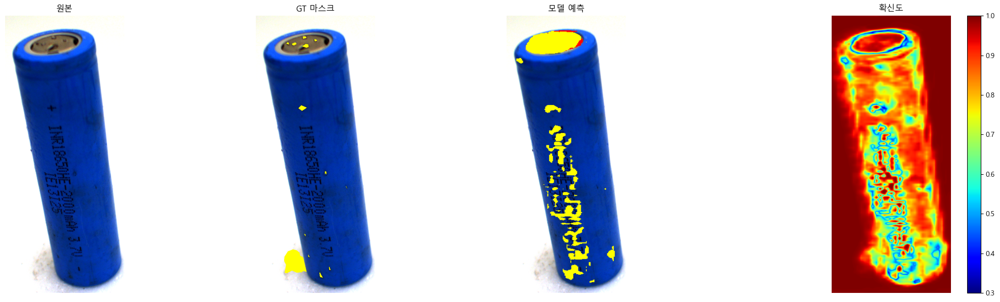
    


    
    [RGB_cell_cylindrical_0731_240] 라벨=pollution  GT: P=5797px D=0px  모델: P=38420px D=5262px
    


    
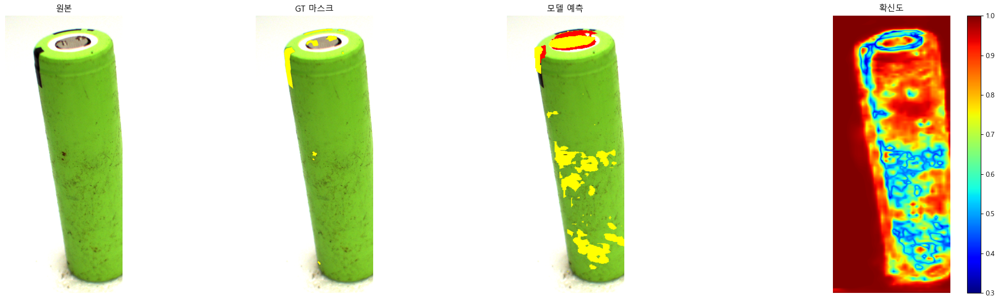
    


    
    [RGB_cell_cylindrical_0917_121] 라벨=both  GT: P=11224px D=34440px  모델: P=47617px D=31240px
    


    
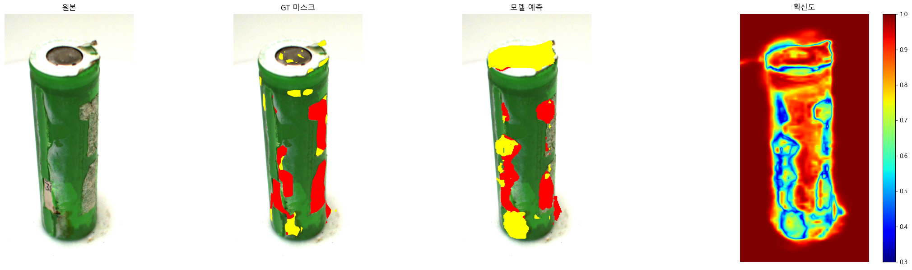
    


    
    [RGB_cell_cylindrical_0748_080] 라벨=pollution  GT: P=5019px D=0px  모델: P=32620px D=940px
    


    
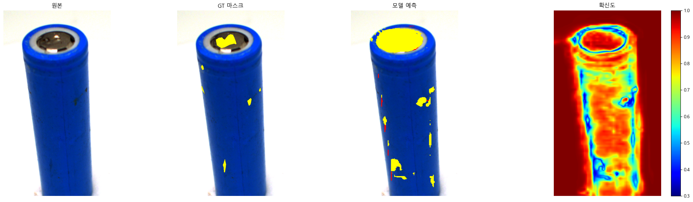
    


    
    [RGB_cell_cylindrical_0832_265] 라벨=pollution  GT: P=32241px D=0px  모델: P=44969px D=11925px
    


    
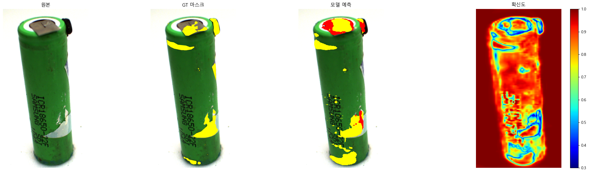
    


    
    [RGB_cell_cylindrical_0891_174] 라벨=both  GT: P=17015px D=3690px  모델: P=34455px D=339px
    


    
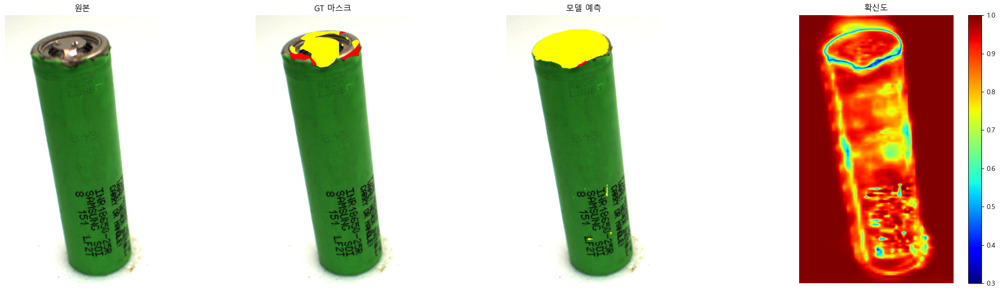
    


    
    [RGB_cell_cylindrical_0791_220] 라벨=both  GT: P=2017px D=7px  모델: P=28997px D=4095px
    


    
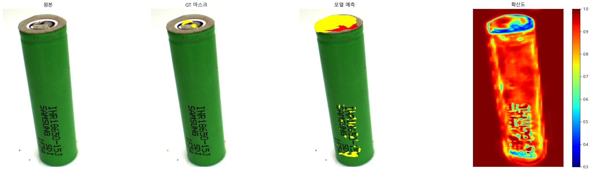
    


    
    [RGB_cell_cylindrical_0916_193] 라벨=both  GT: P=131074px D=9730px  모델: P=158979px D=15584px
    


    
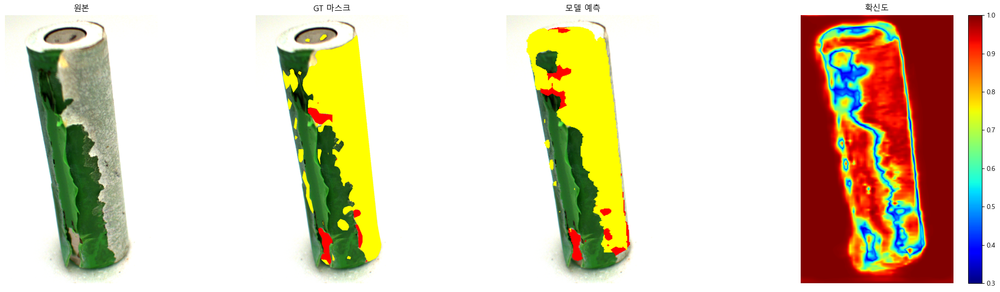
    


    
    [RGB_cell_cylindrical_0851_267] 라벨=both  GT: P=7193px D=230px  모델: P=191363px D=1445px
    


    
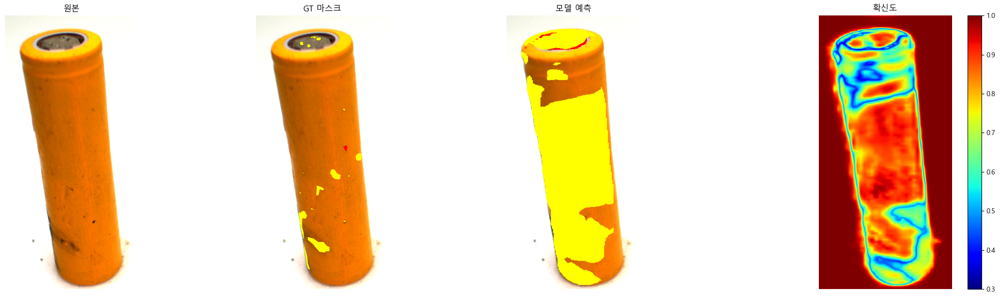
    


    
    [RGB_cell_cylindrical_0821_134] 라벨=pollution  GT: P=2575px D=0px  모델: P=21757px D=124px
    


    
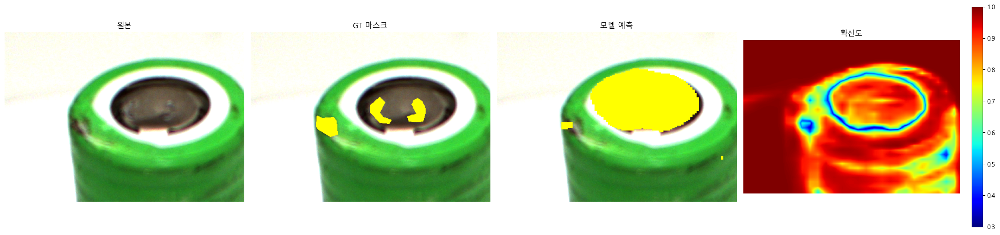
    


    
    ========== 정상품 과검 검증 : 13장 ==========
    
    [RGB_cell_cylindrical_1014_296] 라벨=clean  GT: P=0px D=0px  모델: P=6537px D=3081px
    


    
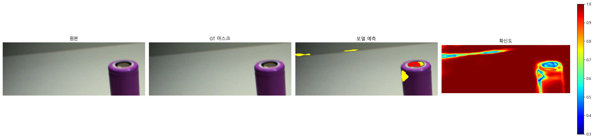
    


    
    [RGB_cell_cylindrical_0954_143] 라벨=clean  GT: P=0px D=0px  모델: P=6064px D=496px
    


    
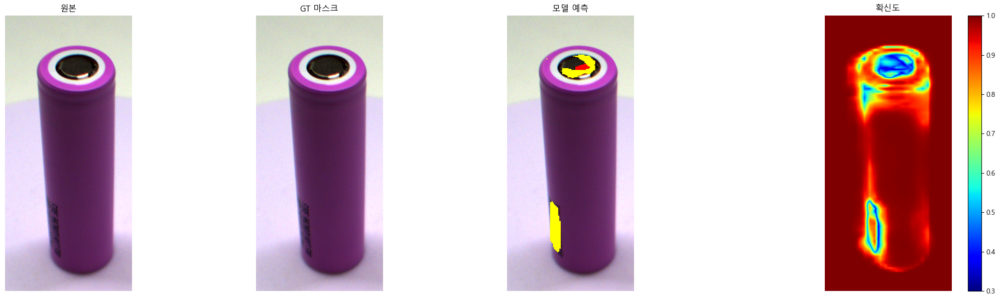
    


    
    [RGB_cell_cylindrical_0921_257] 라벨=clean  GT: P=0px D=0px  모델: P=3113px D=188px
    


    
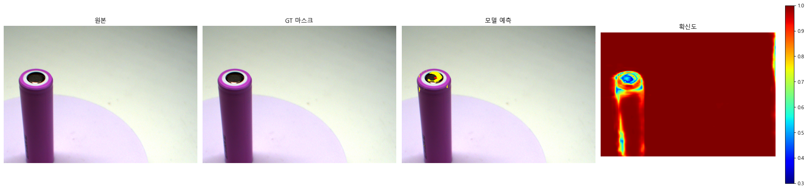
    


    
    [RGB_cell_cylindrical_0974_253] 라벨=clean  GT: P=0px D=0px  모델: P=3521px D=3488px
    


    
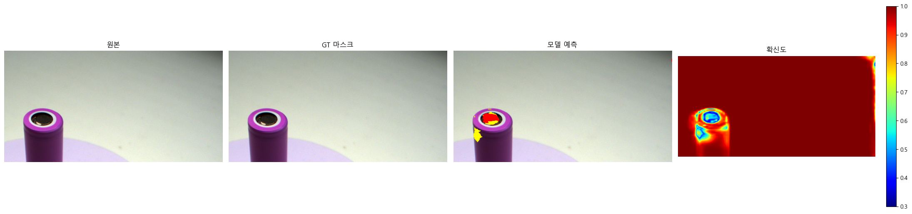
    


    
    [RGB_cell_cylindrical_1156_267] 라벨=clean  GT: P=0px D=0px  모델: P=4098px D=7438px
    


    
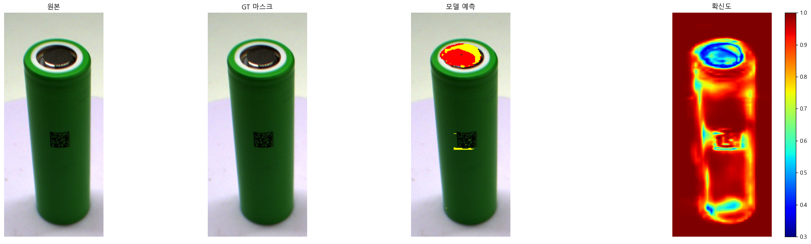
    


    
    [RGB_cell_cylindrical_1156_249] 라벨=clean  GT: P=0px D=0px  모델: P=6928px D=6914px
    


    
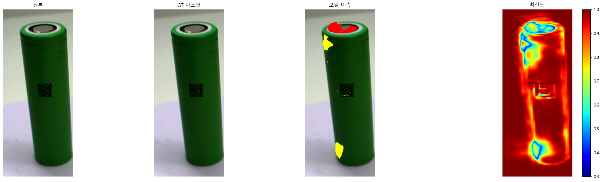
    


    
    [RGB_cell_cylindrical_0960_151] 라벨=clean  GT: P=0px D=0px  모델: P=3703px D=1293px
    


    
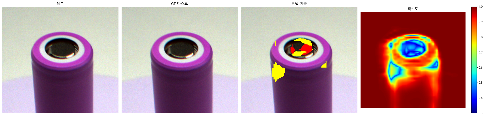
    


    
    [RGB_cell_cylindrical_0988_125] 라벨=clean  GT: P=0px D=0px  모델: P=4048px D=587px
    


    
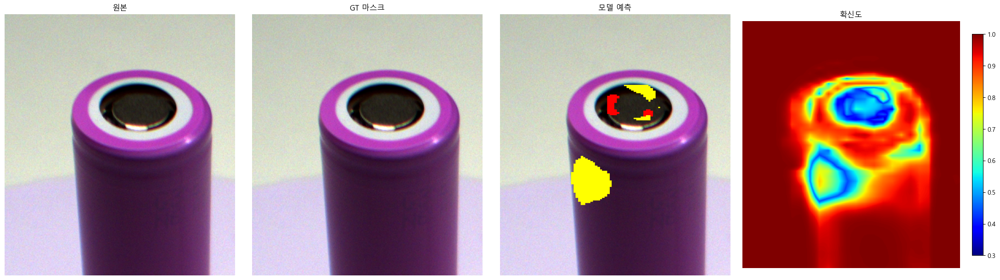
    


    
    [RGB_cell_cylindrical_1017_241] 라벨=clean  GT: P=0px D=0px  모델: P=9722px D=2574px
    


    
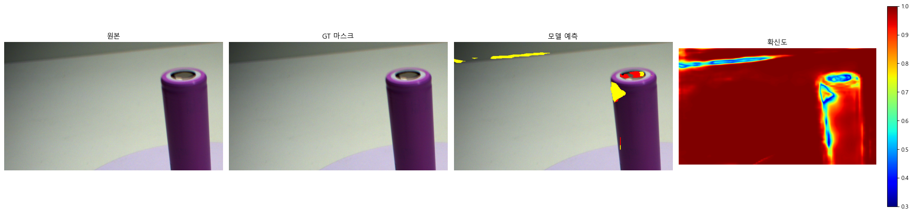
    


    
    [RGB_cell_cylindrical_0996_020] 라벨=clean  GT: P=0px D=0px  모델: P=8536px D=455px
    


    
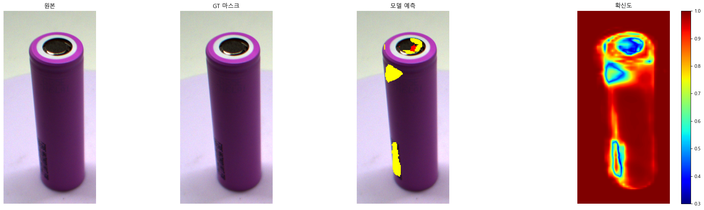
    


    
    [RGB_cell_cylindrical_1154_284] 라벨=clean  GT: P=0px D=0px  모델: P=7875px D=8807px
    


    
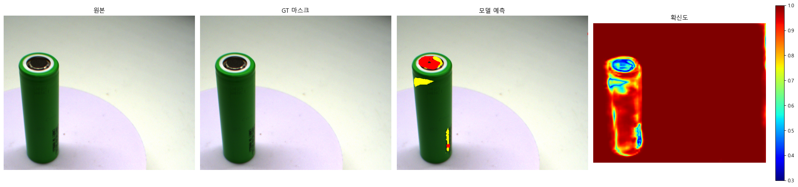
    


    
    [RGB_cell_cylindrical_1155_099] 라벨=clean  GT: P=0px D=0px  모델: P=9276px D=3856px
    


    
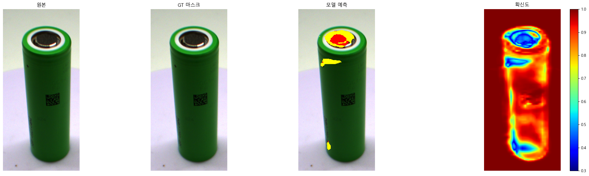
    


    
    [RGB_cell_cylindrical_1154_187] 라벨=clean  GT: P=0px D=0px  모델: P=5402px D=3956px
    


    
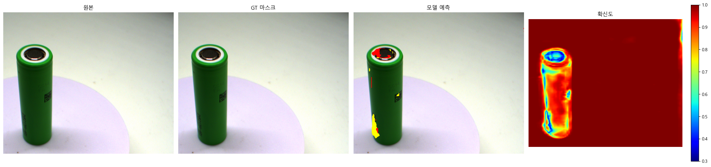
    


```python
gt_verdict = {

    # ---------------------------------------------------------
    # 불량품 과검 사례 분석
    # ---------------------------------------------------------

    # 'RGB_cell_cylindrical_0781_050':
    # 'GT 정상',
    # '모델이 GT 대비 더 넓은 영역을 비정상으로 예측하였으며,
    # 특히 상단 영역에서 노란색 NG 검출이 과도하게 발생함'

    # 'RGB_cell_cylindrical_0920_061':
    # 'GT 정상',
    # '상단 영역에서 비정상 예측 범위가 GT 대비 확대되었으며,
    # GT 대비 노란색 예측 영역이 상단 전체로 확장되는 경향 확인'

    # 'RGB_cell_cylindrical_0731_017':
    # 'GT 정상',
    # '상단 테이핑 영역을 비정상으로 오검출하였으며,
    # GT에는 존재하지 않는 빨간색 오염 영역이 추가 예측됨'

    # 'RGB_cell_cylindrical_0913_223':
    # 'GT 정상',
    # '상단 영역 및 셀 텍스트 영역을 오염으로 잘못 판단하는 과검 현상 확인'

    # 'RGB_cell_cylindrical_0731_240':
    # 'GT 정상',
    # '상단 및 측면 영역에서 GT 대비 과도한 오염 검출 발생.
    # 일부 영역은 GT에 존재하지 않는 빨간색 오염으로 예측됨'

    # 'RGB_cell_cylindrical_0917_121':
    # 'GT 정상',
    # '상단 및 측면 영역에서 GT 대비 넓은 범위를 오염으로 예측하는 경향 확인'

    # 'RGB_cell_cylindrical_0748_080':
    # 'GT 정상',
    # '측면 영역에서 GT에 존재하지 않는 빨간색 오염 검출 발생.
    # 상단 영역 또한 과검 경향 확인'

    # 'RGB_cell_cylindrical_0832_265':
    # 'GT 정상',
    # '측면 및 상단 영역에서 GT 대비 과도한 비정상 검출 발생'

    # 'RGB_cell_cylindrical_0891_174':
    # 'GT 정상',
    # 'GT 대비 빨간색 오염 검출 범위가 축소되었으며,
    # 상단 영역에서는 노란색 과검 경향 확인'

    # ---------------------------------------------------------
    # 정상품 과검 사례 분석
    # ---------------------------------------------------------

    # 'RGB_cell_cylindrical_1014_296':
    # 'GT 정상',
    # '배경 영역 및 캔 상단 영역에서 비정상 예측 발생'

    # 'RGB_cell_cylindrical_0954_143':
    # 'GT 정상',
    # '캔 상단 및 배터리 텍스트 영역에서 오염으로 잘못 예측하는 현상 확인'

    # 'RGB_cell_cylindrical_0921_257':
    # 'GT 정상',
    # '캔 상단 영역에서 빨간색 및 노란색 비정상 예측 발생'

    # 'RGB_cell_cylindrical_0974_253':
    # 'GT 정상',
    # '상단 및 측면 영역에서 과검 경향 확인'

    # 'RGB_cell_cylindrical_1156_267':
    # 'GT 정상',
    # '캔 상단 영역에서 비정상 예측 발생'

    # 'RGB_cell_cylindrical_0996_020':
    # 'GT 정상',
    # '배터리 텍스트 및 상단 영역을 오염으로 잘못 예측하는 현상 확인'

}
```

정상품에서 상단 영역 중심의 반복적인 False Positive 패턴을 확인하였으며, 텍스트 및 반사 영역에 대한 추가 후처리 개선 필요성을 확인하였습니다.

## 4. 과검(False Positive) 원인 분석

모델 학습 노트북(`04_finetune_colab.ipynb`)의 loss 설정 및 클래스 분포를 분석한 결과,  
정상품에서 반복적으로 발생한 과검 현상의 주요 원인을 확인할 수 있었습니다.

1. Loss Weight 설정 분석

학습 과정에서는 클래스 불균형 문제를 완화하기 위해 아래와 같은 가중치 계산 방식을 적용하였습니다.

```python
freq = counts / counts.sum()
weights = 1.0 / np.log(1.02 + freq)
criterion = nn.CrossEntropyLoss(weight=class_weights)
```

데이터셋 특성상 배경(background) 픽셀 비율은 매우 높고, 결함 클래스는 상대적으로 적은 비율을 차지하였습니다.

해당 weight 공식을 적용한 결과:

Background 클래스 가중치: 약 0.05
Pollution / Damaged 클래스 가중치: 약 1.4 ~ 1.6

수준으로 계산되었습니다.

2. 과검 발생 원인 분석

`CrossEntropyLoss(weight=...)`는 정답 클래스 기준으로 loss를 계산합니다.

이로 인해:

- 실제 결함을 놓치는 경우(False Negative)는 높은 penalty가 적용되고,
- 정상품을 결함으로 예측하는 경우(False Positive)는 상대적으로 낮은 penalty가 적용되는 구조가 형성되었습니다.

결과적으로 모델은 학습 과정에서:

> "불확실한 영역은 결함으로 예측하는 방향"

으로 최적화되었을 가능성을 확인하였습니다.

실제 검증 과정에서도

- 캔 상단 영역
- 텍스트(바코드) 영역
- 반사 영역

등에서 반복적인 과검 패턴이 확인되었습니다.

3. 데이터셋 구성 재확인

초기에는 깨끗한 상단 영역(clean cap) 데이터 부족 가능성을 우선적으로 고려하였습니다.

그러나 학습 데이터셋을 재확인한 결과:

- Train 이미지 174장 중
- Clean 샘플은 112장

으로 확인되었습니다.

이를 통해 loss weight 설정이 과검 경향에 더 큰 영향을 주었을 가능성이 높다고 판단하였습니다.

4. 개선 방향

현재 모델은 Backbone 및 ASPP 영역은 freeze 상태이며, decoder 중심으로 학습이 진행되고 있습니다.

따라서:

- loss weight 재조정
- threshold tuning
- 후처리 개선

등을 기반으로 비교적 빠른 재학습 및 성능 개선이 가능할 것으로 판단하였습니다.

5. 추가 검증 사항

주요 원인은 loss weight 설정으로 판단되었으나,
추가적으로 train mask 품질에 대한 검증도 필요하다고 판단하였습니다.

특히:

Train 마스크 일부가 실제 결함보다 넓게 라벨링되었는지
특정 영역(상단, 텍스트, 반사 영역)에 loose annotation이 존재하는지

등을 추가 확인 대상으로 설정하였습니다.

이를 통해 과검 발생 원인을 보다 정확하게 분석하고자 하였습니다.

test 셋에서 분쟁이 된 27장(결함 14장 + 과검 정상 13장)은 육안 검증을 완료하였으며, train 결함 마스크 62장 중 표본 20장을 추가로 확인하겠습니다.

### 4.1 학습 클래스 가중치 재현 — 과예측 원인 확인


```python
# === 학습 클래스 가중치 재현 — 과예측 원인 #1 확정 ===
from PIL import Image
train_names = pd.read_csv(SPLIT.parent / 'train_meta.csv')['name'].tolist()
counts = np.zeros(3, dtype=np.int64)
for nm in train_names:
    m = np.array(Image.open(MASK_DIR / f'{nm}.png'))
    for c in range(3):
        counts[c] += int((m == c).sum())
freq = counts / counts.sum()
weights = 1.0 / np.log(1.02 + freq)
weights = weights / weights.sum() * NUM_CLASSES
for c, nm in enumerate(CLASS_NAMES):
    print(f'{nm:<11} 픽셀비율 {freq[c]*100:8.4f}%   가중치 {weights[c]:.3f}')
print(f'\n결함:배경 가중치 비율 — Pollution {weights[1]/weights[0]:.0f}배, '
    f'Damaged {weights[2]/weights[0]:.0f}배')
print('→ 이 비율이 10배 이상이면 과예측 유발 loss로 확정')
```

    background  픽셀비율  99.4227%   가중치 0.047
    Pollution   픽셀비율   0.4526%   가중치 1.372
    Damaged     픽셀비율   0.1247%   가중치 1.581
    
    결함:배경 가중치 비율 — Pollution 29배, Damaged 33배
    → 이 비율이 10배 이상이면 과예측 유발 loss로 확정
    

### 4.2 train 결함 마스크 + 모델 예측 audit


```python
train_df  = pd.read_csv(SPLIT.parent / 'train_meta.csv')
train_def = train_df[train_df['label'].isin(['pollution', 'both'])].reset_index(drop=True)
print(f'train 결함 이미지: {len(train_def)}장 (표본 20장 표시 — 전체는 .head(20) 제거)')

for _, r in train_def.head(20).iterrows():
    name = r['name']
    p   = IMG_DIR / f'{name}.png'
    img = cv2.cvtColor(cv2.imread(str(p)), cv2.COLOR_BGR2RGB)
    gt  = cv2.imread(str(MASK_DIR / f'{name}.png'), cv2.IMREAD_GRAYSCALE)
    cls, _ = predict(p)

    ys, xs = np.where(gt > 0)
    if len(ys):
        m = 110
        y0, y1 = max(0, ys.min()-m), min(img.shape[0], ys.max()+m)
        x0, x1 = max(0, xs.min()-m), min(img.shape[1], xs.max()+m)
    else:
        y0, y1, x0, x1 = 0, img.shape[0], 0, img.shape[1]

    gt_ov = img.copy(); gt_ov[gt == 1] = (255,255,0); gt_ov[gt == 2] = (255,0,0)
    pr_ov = img.copy(); pr_ov[cls == 1] = (255,255,0); pr_ov[cls == 2] = (255,0,0)
    print(f"\n[{name}] 라벨={r['label']}  "
        f"GT P={int((gt==1).sum())} D={int((gt==2).sum())}  "
        f"모델 P={int((cls==1).sum())} D={int((cls==2).sum())}")
    fig, ax = plt.subplots(1, 3, figsize=(17, 5.5))
    ax[0].imshow(img[y0:y1, x0:x1]);   ax[0].set_title('원본')
    ax[1].imshow(gt_ov[y0:y1, x0:x1]); ax[1].set_title('train GT 마스크')
    ax[2].imshow(pr_ov[y0:y1, x0:x1]); ax[2].set_title('모델 예측')
    for a in ax:
        a.axis('off')
    plt.tight_layout()
    plt.show()
```

    train 결함 이미지: 62장 (표본 20장 표시 — 전체는 .head(20) 제거)
    
    [RGB_cell_cylindrical_0810_299] 라벨=both  GT P=1598 D=29  모델 P=27386 D=2312
    


    
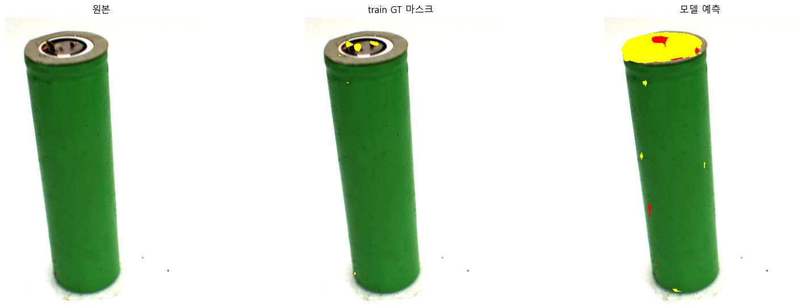
    


    
    [RGB_cell_cylindrical_0917_108] 라벨=both  GT P=18195 D=22011  모델 P=57062 D=24252
    


    
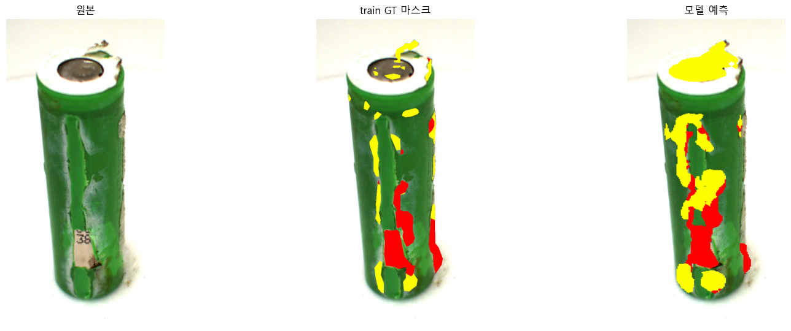
    


    
    [RGB_cell_cylindrical_0913_297] 라벨=pollution  GT P=1859 D=0  모델 P=19806 D=613
    


    
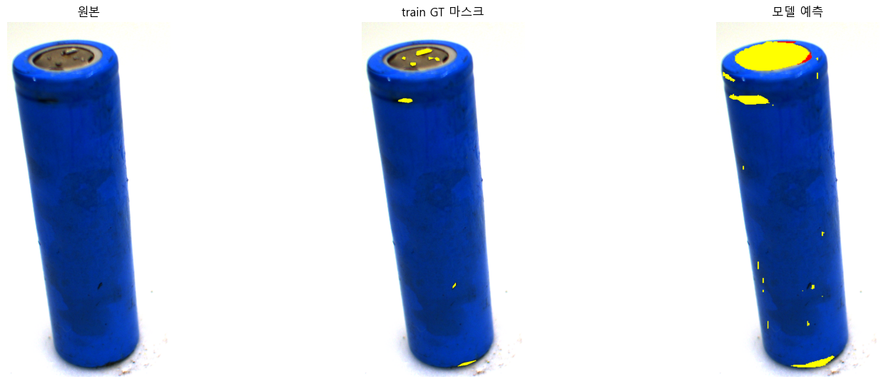
    


    
    [RGB_cell_cylindrical_0831_233] 라벨=pollution  GT P=16476 D=0  모델 P=9721 D=8843
    


    
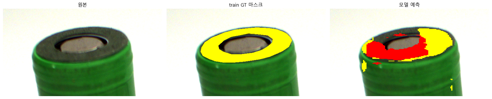
    


    
    [RGB_cell_cylindrical_0729_189] 라벨=pollution  GT P=20798 D=0  모델 P=12738 D=70
    


    
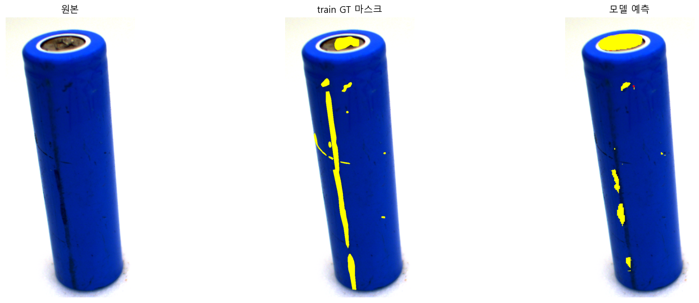
    


    
    [RGB_cell_cylindrical_0791_009] 라벨=pollution  GT P=4608 D=0  모델 P=39933 D=3135
    


    
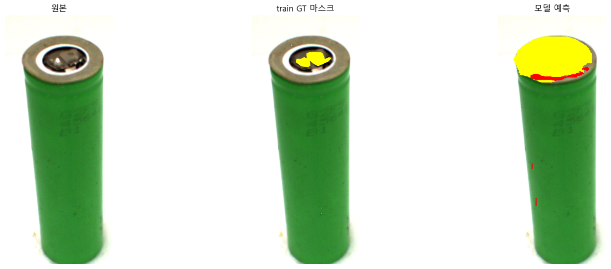
    


    
    [RGB_cell_cylindrical_0913_053] 라벨=pollution  GT P=858 D=0  모델 P=30042 D=811
    


    
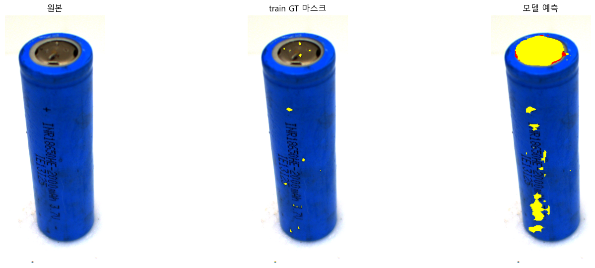
    


    
    [RGB_cell_cylindrical_0820_043] 라벨=pollution  GT P=3964 D=0  모델 P=20073 D=1595
    


    
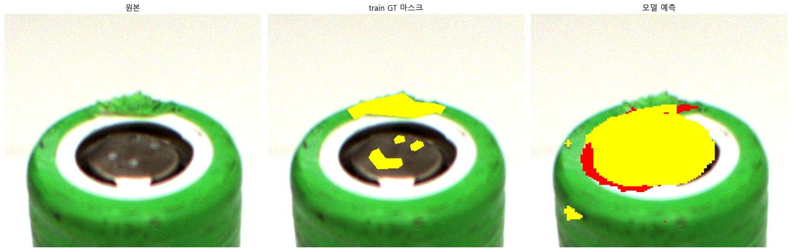
    


    
    [RGB_cell_cylindrical_0794_088] 라벨=both  GT P=23491 D=4530  모델 P=34091 D=8
    


    
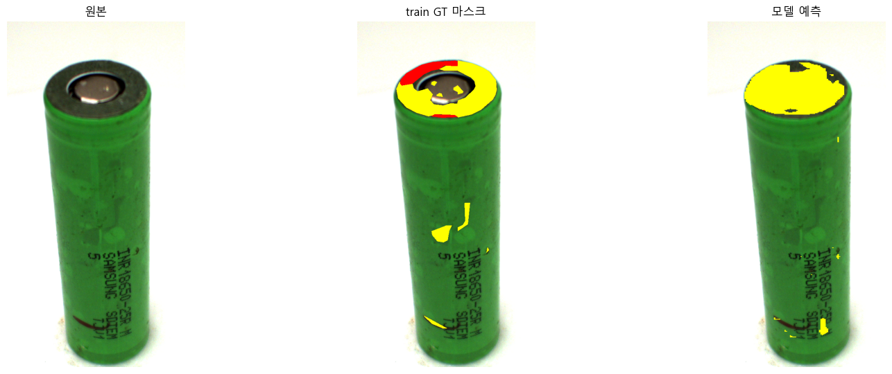
    


    
    [RGB_cell_cylindrical_0916_184] 라벨=both  GT P=65182 D=17661  모델 P=116419 D=15122
    


    
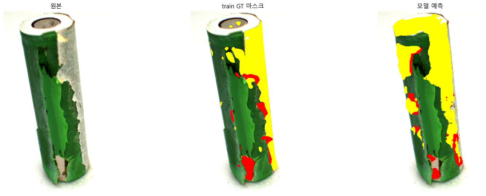
    


    
    [RGB_cell_cylindrical_0916_044] 라벨=both  GT P=154809 D=23400  모델 P=210301 D=1109
    


    
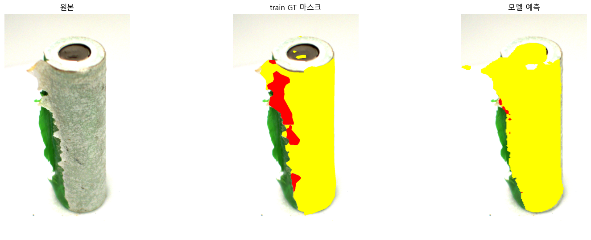
    


    
    [RGB_cell_cylindrical_0822_264] 라벨=pollution  GT P=918 D=0  모델 P=23001 D=15759
    


    
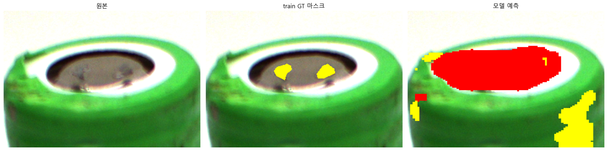
    


    
    [RGB_cell_cylindrical_0916_209] 라벨=both  GT P=201660 D=19599  모델 P=245891 D=1993
    


    
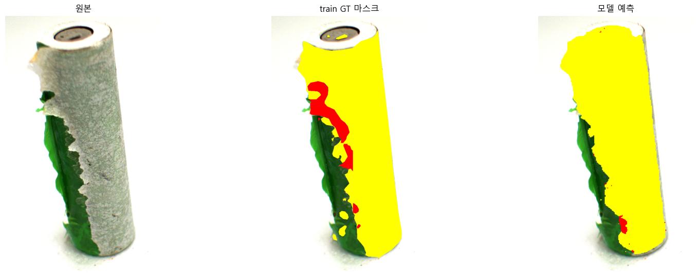
    


    
    [RGB_cell_cylindrical_0833_265] 라벨=pollution  GT P=13774 D=0  모델 P=35852 D=3289
    


    
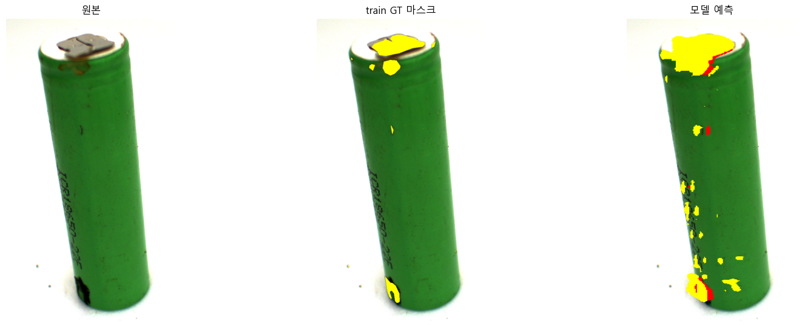
    


    
    [RGB_cell_cylindrical_0811_005] 라벨=pollution  GT P=1231 D=0  모델 P=33696 D=1218
    


    
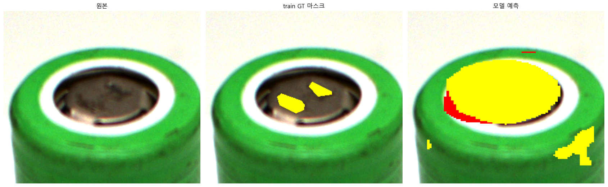
    


    
    [RGB_cell_cylindrical_0882_125] 라벨=both  GT P=804 D=17  모델 P=20601 D=2233
    


    
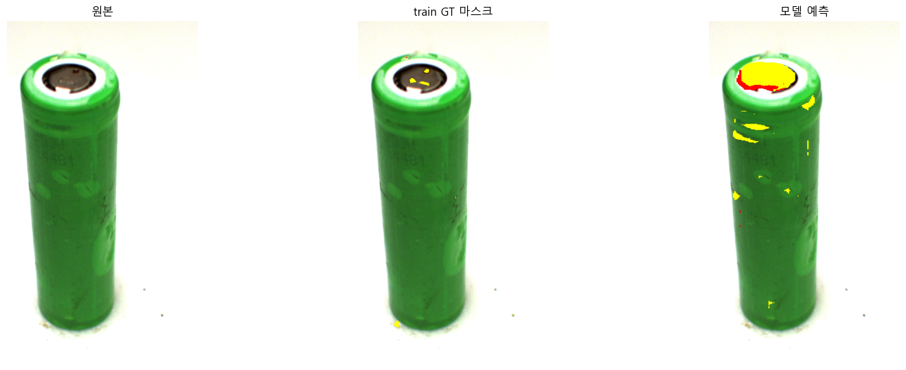
    


    
    [RGB_cell_cylindrical_0913_132] 라벨=both  GT P=3980 D=16  모델 P=24636 D=456
    


    
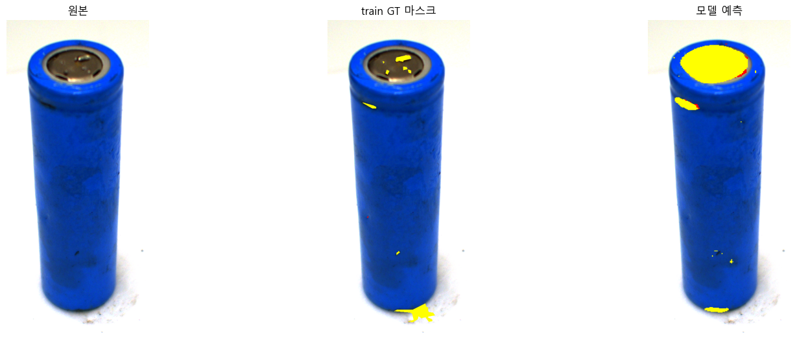
    


    
    [RGB_cell_cylindrical_0895_243] 라벨=both  GT P=689 D=18702  모델 P=19262 D=11569
    


    
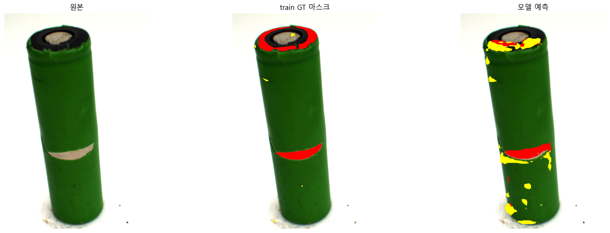
    


    
    [RGB_cell_cylindrical_0850_024] 라벨=both  GT P=7665 D=4263  모델 P=42370 D=2224
    


    
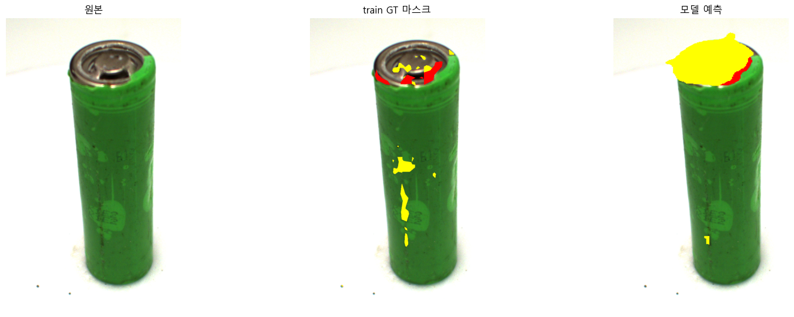
    


    
    [RGB_cell_cylindrical_0917_017] 라벨=both  GT P=11069 D=28658  모델 P=62303 D=24223
    


    
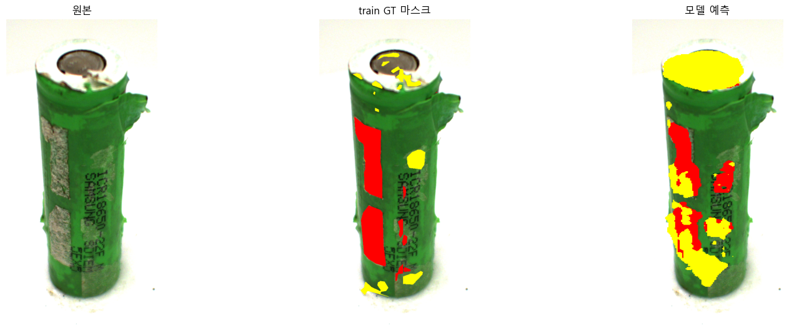
    


학습에 사용된 train 결함 이미지 표본 20장을 재추론한 결과, 모델은 학습 데이터에서조차 GT 마스크보다 평균 수 배(최대 약 35배) 넓게 결함을 예측하였습니다.

학습에 쓰인 이미지에서도 동일한 과예측이 나타난다는 점은, 이 현상이 특정 데이터에 대한 과적합이 아니라 loss weight 설정에 있으므로

핵심 개선책인 loss 재설계 후 재학습하겠습니다.

개선 방향

- 클래스 가중치 완화: 현행 1/np.log(1.02+freq)는 결함:배경 가중치를 약 30배로 만듭니다.<br/>
분모 상수(1.02)를 키우거나 가중치를 직접 지정하여 결함:배경 비율을 약 3~5배 수준으로 낮추면, FP에도 합리적인 penalty가 부여됩니다.
- loss 함수 보강: CrossEntropy에 Dice loss를 결합(CE + Dice)하면, 예측 영역이 넓어질수록 Dice score가 낮아져 과예측에 직접 penalty가 부여되므로 과검을 구조적으로 억제할 수 있습니다. (또는 Focal loss로 대체)
- 현재 backbone·ASPP는 freeze 상태이고 decoder만 학습하므로, 재학습 비용이 크지 않아 빠른 반복 개선이 가능합니다.
- 재학습 시 검증 지표로 mIoU와 함께 정상품 과검율(FP 지표) 을 추적하여, 과예측 경향을 학습 단계에서 조기에 발견하도록 보완합니다.

모델 학습 노트북(`04_finetune_colab.ipynb`) 기반으로 (`07_re_finetune_colab.ipynb`) 을 만들어서 다시 학습하겠습니다.
