# 0. 환경 점검 + 경로 정의

### 0-1. 환경 & 경로


```python
from pathlib import Path
import numpy as np
import pandas as pd
import cv2
import matplotlib.pyplot as plt

PROJECT  = Path(r'D:\02.study\part4_wj\Battery\Battery_Project')
ONNX_OUT = PROJECT / 'models' / 'battery_deeplab_v2.onnx'
IMG_DIR  = PROJECT / 'battery_image'
MASK_DIR = PROJECT / 'battery_mask'
SPLIT    = PROJECT / 'battery_splits' / 'test_meta.csv'
DEMO_DIR = PROJECT / 'notebooks_docs' / 'Demo_Image'
REPORT   = PROJECT / 'docs' / '09_re_verification_report.md'

for p in [ONNX_OUT, IMG_DIR, MASK_DIR, SPLIT]:
    assert p.exists(), f'경로 없음: {p}'
DEMO_DIR.mkdir(parents=True, exist_ok=True)

# 클래스 정의 — 학습 인덱스와 1:1 일치 (data_card.md §3)
CLASS_NAMES = ['background', 'Pollution', 'Damaged']
NUM_CLASSES = 3
# 시각화 팔레트 (RGB) — Pollution=노랑, Damaged=빨강
PALETTE = np.array([[0, 0, 0], [255, 255, 0], [255, 0, 0]], dtype=np.uint8)

# 한글 깨짐 마이너스 부호 깨짐 방지
plt.rcParams['font.family'] = 'Malgun Gothic'
plt.rcParams['axes.unicode_minus'] = False

print('경로 확인 완료')
```

    경로 확인 완료
    

## 1. test 셋 로드 + 분포 확인

모집단 `test_meta.csv`로 검증 대상 38장을 불러오고, clean / pollution / both 분포를 출력합니다.

### 1-1. test 셋 로드


```python
df = pd.read_csv(SPLIT)                       # 컬럼: name, label
df['img']  = df['name'].apply(lambda n: IMG_DIR  / f'{n}.png')
df['mask'] = df['name'].apply(lambda n: MASK_DIR / f'{n}.png')

# 파일 존재 검증 — 하나라도 없으면 즉시 멈춤
missing = df[~df['img'].apply(Path.exists) | ~df['mask'].apply(Path.exists)]
assert missing.empty, f'누락 파일:\n{missing["name"].tolist()}'

print(f'test 셋: {len(df)}장')
print(df['label'].value_counts())

ok_df = df[df['label'] == 'clean'].reset_index(drop=True)       # 정상품 24
defect_df = df[df['label'].isin(['pollution', 'both'])].reset_index(drop=True)  # 결함 14
print(f'\n정상품(OK): {len(ok_df)}장   결함: {len(defect_df)}장')
```

    test 셋: 38장
    label
    clean        24
    both          7
    pollution     7
    Name: count, dtype: int64
    
    정상품(OK): 24장   결함: 14장
    

## 2. ONNX 추론 함수

추론 엔진을 구성하기 위해

C# `Postprocessor.cs`와 **완전히 동일한 전처리**로 추론하는 함수를 만듭니다.

### 2-1. (GPU 사용 시) NVIDIA 런타임 DLL 경로 등록


```python
import os
NVIDIA_BIN = PROJECT / 'venv_battery' / 'Lib' / 'site-packages' / 'nvidia'
for sub in ['cudnn', 'cuda_runtime', 'cublas']:
    d = str(NVIDIA_BIN / sub / 'bin')
    if Path(d).is_dir():
        os.add_dll_directory(d)
        os.environ['PATH'] = d + os.pathsep + os.environ['PATH']
        print(f'CUDA DLL dir added: {d}')
```

    CUDA DLL dir added: D:\02.study\part4_wj\Battery\Battery_Project\venv_battery\Lib\site-packages\nvidia\cudnn\bin
    CUDA DLL dir added: D:\02.study\part4_wj\Battery\Battery_Project\venv_battery\Lib\site-packages\nvidia\cuda_runtime\bin
    CUDA DLL dir added: D:\02.study\part4_wj\Battery\Battery_Project\venv_battery\Lib\site-packages\nvidia\cublas\bin
    

### 2-2. ORT 세션 생성


```python
import onnxruntime as ort

sess = ort.InferenceSession(
    str(ONNX_OUT),
    providers=['CUDAExecutionProvider', 'CPUExecutionProvider'],
)
INPUT_NAME  = sess.get_inputs()[0].name
OUTPUT_NAME = sess.get_outputs()[0].name
print(f'입력: {INPUT_NAME}  출력: {OUTPUT_NAME}')
print(f'실제 사용 provider: {sess.get_providers()}')
```

    입력: input  출력: logits
    실제 사용 provider: ['CUDAExecutionProvider', 'CPUExecutionProvider']
    

> `CUDAExecutionProvider`가 결과로 나왔으니 GPU 를 사용하고 있는 상태임을 확인하였습니다.

### 2-3. 전처리 + 추론 함수


```python
SIZE = 513
MEAN = np.array([0.485, 0.456, 0.406], dtype=np.float32)
STD  = np.array([0.229, 0.224, 0.225], dtype=np.float32)

def _softmax(logits, axis=0):
    e = np.exp(logits - logits.max(axis=axis, keepdims=True))
    return e / e.sum(axis=axis, keepdims=True)

def predict(img_path):
    """원본 이미지 → (클래스 마스크[H,W], 클래스 확률[3,H,W]). 모두 원본 해상도."""
    bgr = cv2.imread(str(img_path), cv2.IMREAD_COLOR)
    if bgr is None:
        raise FileNotFoundError(img_path)
    H, W = bgr.shape[:2]

    rgb = cv2.cvtColor(bgr, cv2.COLOR_BGR2RGB)
    resized = cv2.resize(rgb, (SIZE, SIZE), interpolation=cv2.INTER_LINEAR)
    x = resized.astype(np.float32) / 255.0
    x = (x - MEAN) / STD                          # ImageNet 정규화
    x = x.transpose(2, 0, 1)[None]                # HWC → NCHW

    logits = sess.run([OUTPUT_NAME], {INPUT_NAME: x})[0][0]   # (3,513,513)
    prob513 = _softmax(logits, axis=0)
    cls513  = logits.argmax(0).astype(np.uint8)

    # 원본 해상도 복원 — 클래스는 nearest(인덱스 보존), 확률은 linear
    cls_full  = cv2.resize(cls513, (W, H), interpolation=cv2.INTER_NEAREST)
    prob_full = np.stack([cv2.resize(prob513[c], (W, H), interpolation=cv2.INTER_LINEAR) for c in range(NUM_CLASSES)], axis=0)
    
    return cls_full, prob_full

# 동작 확인 — 결함 1장
_cls, _prob = predict(defect_df.loc[0, 'img'])
print(f'예측 마스크 shape={_cls.shape}, 클래스값={np.unique(_cls)}')
```

    예측 마스크 shape=(1080, 1920), 클래스값=[0 1 2]
    

## 3. DL 정상품 과검 검증

학습에 쓰이지 않은 **정상품 24장**을 추론합니다.

정답 마스크가 전부 background인 이미지에서 **모델이 결함 픽셀을 얼마나 잘못 잡는지(과검)** 를 측정합니다.

### 3-1. 정상품 과검 측정


```python
MIN_DEFECT_AREA = 100   # 이 픽셀 수 미만은 노이즈로 보고 과검에서 제외 (EDA Pollution 중앙값 139px)
TOTAL_PX = 1920 * 1080

rows = []
for _, r in ok_df.iterrows():
    cls, _ = predict(r['img'])
    poll_px = int((cls == 1).sum())
    dmg_px  = int((cls == 2).sum())
    defect_px = poll_px + dmg_px
    rows.append({'name': r['name'], 'Pollution_px': poll_px,
                 'Damaged_px': dmg_px, 'defect_px': defect_px,
                 'overkill': defect_px >= MIN_DEFECT_AREA})

ok_res = pd.DataFrame(rows)
n_overkill = int(ok_res['overkill'].sum())
overkill_rate = n_overkill / len(ok_res)

print(f'정상품 {len(ok_res)}장 중 과검 {n_overkill}장  (과검율 {overkill_rate*100:.1f}%)')
print(f'정상품 평균 오검 픽셀: {ok_res["defect_px"].mean():.0f} px '
      f'(전체 {TOTAL_PX:,}px 대비 {ok_res["defect_px"].mean()/(TOTAL_PX)*100:.3f}%)')
print('\n과검 발생 이미지 (defect_px 큰 순 상위 5):')
print(ok_res.sort_values('defect_px', ascending=False).head())
```

    정상품 24장 중 과검 24장  (과검율 100.0%)
    정상품 평균 오검 픽셀: 3635 px (전체 2,073,600px 대비 0.175%)
    
    과검 발생 이미지 (defect_px 큰 순 상위 5):
                                 name  Pollution_px  Damaged_px  defect_px  \
    21  RGB_cell_cylindrical_1154_284          7591        1654       9245   
    3   RGB_cell_cylindrical_1156_275          7088        1235       8323   
    23  RGB_cell_cylindrical_1154_187          7183         424       7607   
    22  RGB_cell_cylindrical_1155_099          5233         987       6220   
    10  RGB_cell_cylindrical_1156_267          3938        1079       5017   
    
        overkill  
    21      True  
    3       True  
    23      True  
    22      True  
    10      True  
    

### 3-2. 후처리 적용 후 과검 재측정

3-1의 raw 출력은 픽셀 단위 분류기 특성상 노이즈가 섞여 과검율 100%로 나왔습니다.

**① morphological opening** 으로 점 노이즈를 지우고,

**② connected components 의 최소 면적 필터** 로 작은 블롭을 제거한 뒤 다시 측정합니다.

### 3-2-1. 후처리 함수 정의 (morphology + 면적 필터)


```python
# 후처리 하이퍼파라미터 (튜닝 포인트)
KERNEL_SIZE = 3       # opening 커널 크기 — 클수록 더 공격적으로 노이즈 제거
MIN_AREA    = 500     # 결함으로 인정할 최소 블롭 면적(px)

KERNEL = cv2.getStructuringElement(cv2.MORPH_ELLIPSE, (KERNEL_SIZE, KERNEL_SIZE))

def postprocess(cls, min_area=MIN_AREA, kernel=KERNEL):
    """
    raw 클래스 마스크 → 정제된 클래스 마스크.
    1) 클래스별 이진 마스크로 분리
    2) morphological opening 으로 점 노이즈 제거
    3) connected components 후 min_area 미만 블롭 제거
    """
    cleaned = np.zeros_like(cls)
    for c in [1, 2]:                                          # background(0) 제외
        bin_mask = (cls == c).astype(np.uint8)
        opened   = cv2.morphologyEx(bin_mask, cv2.MORPH_OPEN, kernel)
        n, labels, stats, _ = cv2.connectedComponentsWithStats(opened, connectivity=8)
        for i in range(1, n):                                 # 0번은 배경
            if stats[i, cv2.CC_STAT_AREA] >= min_area:
                cleaned[labels == i] = c
    return cleaned

# 동작 확인 — 결함 1장
_cls, _ = predict(defect_df.loc[0, 'img'])
_pp = postprocess(_cls)
print(f'raw 결함 픽셀:  {int((_cls > 0).sum()):>7d}')
print(f'후처리 후:     {int((_pp  > 0).sum()):>7d}')
```

    raw 결함 픽셀:    44715
    후처리 후:       42957
    

### 3-2-2. 정상품 24장에 적용 + 재측정 


```python
TOTAL_PX = 1920 * 1080

rows = []
for _, r in ok_df.iterrows():
    cls, _ = predict(r['img'])
    cls_pp = postprocess(cls)
    poll_px = int((cls_pp == 1).sum())
    dmg_px  = int((cls_pp == 2).sum())
    defect_px = poll_px + dmg_px
    rows.append({'name': r['name'], 'Pollution_px': poll_px,
                 'Damaged_px': dmg_px, 'defect_px': defect_px,
                 'overkill': (poll_px + dmg_px) >0,
                 })

ok_pp = pd.DataFrame(rows)
n_over = int(ok_pp['overkill'].sum())
n_over_rate = n_over / len(ok_pp)
mean_px = ok_pp['defect_px'].mean()


print(f'정상품 {len(ok_pp)}장 중 과검 {n_over}장  (과검율 {n_over_rate*100:.1f}%)')
print(f'정상품 평균 오검 픽셀: {mean_px:.0f} px '
      f'(전체 {TOTAL_PX:,}px 대비 {mean_px/TOTAL_PX*100:.3f}%)')
print('\n과검 발생 이미지 (defect_px 큰 순 상위 5):')
print(ok_pp[ok_pp['overkill']].sort_values('defect_px', ascending=False).head())
```

    정상품 24장 중 과검 22장  (과검율 91.7%)
    정상품 평균 오검 픽셀: 2457 px (전체 2,073,600px 대비 0.118%)
    
    과검 발생 이미지 (defect_px 큰 순 상위 5):
                                 name  Pollution_px  Damaged_px  defect_px  \
    23  RGB_cell_cylindrical_1154_187          7038           0       7038   
    21  RGB_cell_cylindrical_1154_284          7020           0       7020   
    3   RGB_cell_cylindrical_1156_275          6441           0       6441   
    22  RGB_cell_cylindrical_1155_099          4710         667       5377   
    10  RGB_cell_cylindrical_1156_267          3370           0       3370   
    
        overkill  
    23      True  
    21      True  
    3       True  
    22      True  
    10      True  
    

후처리(opening + MIN_AREA=500)를 적용했음에도 과검율은 100% → 91.7%(22/24장)로 거의 줄지 않았고,
정상품 평균 오검 픽셀은 약 2,500px(2,457px, 전체 2,073,600px 대비 0.118%) 수준으로 나타났습니다.

상위 과검 이미지의 오검 픽셀 수는 여전히 최대 7,000px대 수준을 기록하고 있습니다 (예: 1154_187 — 7,038px, 1154_284 — 7,020px).

평균 오검 픽셀 수가 이전(약 6,000px)에 비해 절반 이상 줄어든 것을 보면 자잘한 노이즈는 일정 부분 제거되었으나, 과검율이 91.7%로 여전히 높은 이유는 남아있는 노이즈가 단순한 점 노이즈가 아니라 면적이 큰 False Positive 블롭 형태이기 때문입니다. 즉, 현재 설정된 MIN_AREA 면적 필터로는 제거되지 않는 크기(3,000~7,000px 이상)의 과검이 존재한다는 뜻입니다.

따라서 단순 면적·threshold 튜닝만으로는 해결이 어렵다고 판단하여, 다음 단계에서 실제 False Positive가 주로 어느 위치에서 발생하고 있는지 그 특성을 먼저 확인하겠습니다.

### 3-2-3. 워스트 1장 시각화


```python
# 가장 과검이 심한 1장을 골라 raw vs 후처리 결과를 비교
worst = ok_pp.sort_values('defect_px', ascending=False).iloc[0]['name']
img_path = IMG_DIR / f'{worst}.png'

img = cv2.cvtColor(cv2.imread(str(img_path)), cv2.COLOR_BGR2RGB)
cls_raw, _ = predict(img_path)
cls_pp     = postprocess(cls_raw)

overlay_raw = img.copy()
overlay_pp  = img.copy()
overlay_raw[cls_raw == 1] = (255, 255, 0)   # Pollution → 노랑
overlay_raw[cls_raw == 2] = (255, 0,   0)   # Damaged   → 빨강
overlay_pp [cls_pp  == 1] = (255, 255, 0)
overlay_pp [cls_pp  == 2] = (255, 0,   0)

fig, ax = plt.subplots(1, 3, figsize=(18, 6))
ax[0].imshow(img);          ax[0].set_title(f'Origin: {worst}')
ax[1].imshow(overlay_raw);  ax[1].set_title('raw 예측')
ax[2].imshow(overlay_pp);   ax[2].set_title(f'후처리 (MIN_AREA={MIN_AREA})')
for a in ax: a.axis('off')
plt.tight_layout()
plt.show()
```


    
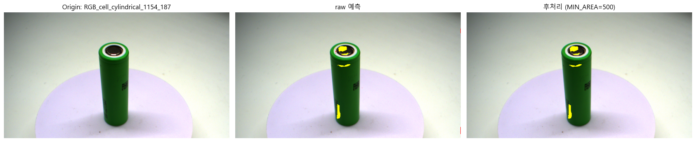
    


### 3-2-4. 블롭 크기 분포 확인


```python
ok_blob_sizes = []
for _, r in ok_df.iterrows():
    cls, _ = predict(r['img'])
    cls_pp = postprocess(cls)
    for c in [1, 2]:
        bin_m = (cls_pp == c).astype(np.uint8)
        n, _, stats, _ = cv2.connectedComponentsWithStats(bin_m, connectivity=8)
        for i in range(1, n):
            ok_blob_sizes.append(stats[i, cv2.CC_STAT_AREA])

# 결함 이미지의 진짜 결함 블롭 크기도 같이
defect_blob_sizes = []
for _, r in defect_df.iterrows():
    msk = cv2.imread(str(r['mask']), cv2.IMREAD_GRAYSCALE)
    for c in [1, 2]:
        bin_m = (msk == c).astype(np.uint8)
        n, _, stats, _ = cv2.connectedComponentsWithStats(bin_m, connectivity=8)
        for i in range(1, n):
            defect_blob_sizes.append(stats[i, cv2.CC_STAT_AREA])

print('정상품 false positive 블롭 크기 분포:')
print(pd.Series(ok_blob_sizes).describe())
print('\n결함 GT 블롭 크기 분포:')
print(pd.Series(defect_blob_sizes).describe())
```

    정상품 false positive 블롭 크기 분포:
    count      39.000000
    mean     1511.897436
    std      1270.791419
    min       500.000000
    25%       746.500000
    50%      1013.000000
    75%      1849.000000
    max      6441.000000
    dtype: float64
    
    결함 GT 블롭 크기 분포:
    count       201.000000
    mean       1829.238806
    std        8900.632200
    min           5.000000
    25%          37.000000
    50%         188.000000
    75%         768.000000
    max      120001.000000
    dtype: float64
    

정상품의 False Positive(FP) 블롭과 실제 결함(GT) 블롭의 크기 분포를 비교한 결과는 다음과 같습니다.

- **정상품 FP 블롭**: 최소 500px, 중위수(Median) 1,013px, 최대 6,441px
- **결함 GT 블롭**: 최소 5px, 중위수(Median) 188px, 상위 75%가 768px 이하

분석 결과, 우리가 제거해야 할 정상품 내 오검(FP) 블롭의 크기가 실제 찾아야 하는 결함(GT)의 크기보다 전반적으로 더 크게 나타나는 역전 현상이 확인되었습니다 (FP 중위수 1,013px > GT 중위수 188px). 

이는 단순히 면적(MIN_AREA) 기준을 높여서 FP를 제거하려고 할 경우, 768px 이하의 크기를 갖는 대다수(75% 이상)의 실제 결함까지 함께 필터링되어 대량의 미검(False Negative)이 발생함을 의미합니다.

따라서 단순 크기 기반의 후처리 필터링만으로는 과검과 진짜 결함을 구분하는 데 한계가 있다고 판단됩니다. 면적 이외의 특징을 파악하기 위해, 다음 단계로 육안 검사를 진행하여 실제 FP가 발생하는 위치와 형태적 특성을 바로 확인하겠습니다.

### 3-2-5. 과검 발생 이미지 육안 확인

육안 검사 하며 정확히 확인하기 위해 확대 분석을 진행하였습니다.


```python
def audit(names, tag):
    print(f'\n========== {tag} : {len(names)}장 ==========')
    for name in names:
        p = IMG_DIR / f'{name}.png'
        img = cv2.cvtColor(cv2.imread(str(p)), cv2.COLOR_BGR2RGB)
        gt  = cv2.imread(str(MASK_DIR / f'{name}.png'), cv2.IMREAD_GRAYSCALE)
        cls, prob = predict(p)
        conf = prob.max(0)
        lab = df.loc[df['name'] == name, 'label'].values[0]

        # 확대 영역: GT 결함이 있으면 GT 기준, 없으면 모델 예측 기준
        ref = gt if (gt > 0).any() else (cls > 0).astype(np.uint8)
        ys, xs = np.where(ref > 0)
        if len(ys):
            m = 110
            y0, y1 = max(0, ys.min()-m), min(img.shape[0], ys.max()+m)
            x0, x1 = max(0, xs.min()-m), min(img.shape[1], xs.max()+m)
        else:
            y0, y1, x0, x1 = 0, img.shape[0], 0, img.shape[1]

        gt_ov = img.copy()
        gt_ov[gt == 1] = (255,255,0); gt_ov[gt == 2] = (255,0,0)
        pr_ov = img.copy()
        pr_ov[cls == 1] = (255,255,0); pr_ov[cls == 2] = (255,0,0)

        print(f"\n[{name}] 라벨={lab}  "
            f"GT: P={int((gt==1).sum())}px D={int((gt==2).sum())}px  "
            f"모델: P={int((cls==1).sum())}px D={int((cls==2).sum())}px")
        fig, ax = plt.subplots(1, 4, figsize=(22, 6))
        ax[0].imshow(img[y0:y1, x0:x1]);   ax[0].set_title('원본')
        ax[1].imshow(gt_ov[y0:y1, x0:x1]); ax[1].set_title('GT 마스크')
        ax[2].imshow(pr_ov[y0:y1, x0:x1]); ax[2].set_title('모델 예측')
        im = ax[3].imshow(conf[y0:y1, x0:x1], cmap='jet', vmin=0.3, vmax=1.0)
        ax[3].set_title('확신도')
        for a in ax:
            a.axis('off')
        plt.colorbar(im, ax=ax[3], fraction=0.046)
        plt.tight_layout()
        plt.show()
```


```python
# 결함 14장 GT 전수 검증
audit(defect_df['name'].tolist(), '결함 GT 검증')

# 정상품 과검(0.70 기준) 검증 — 진짜 깨끗한지 / 라벨 누락 결함인지
audit(ok_pp[ok_pp['overkill']]['name'].tolist(), '정상품 과검 검증')
```

    
    ========== 결함 GT 검증 : 14장 ==========
    
    [RGB_cell_cylindrical_0916_293] 라벨=both  GT: P=22294px D=8897px  모델: P=40904px D=3811px
    


    
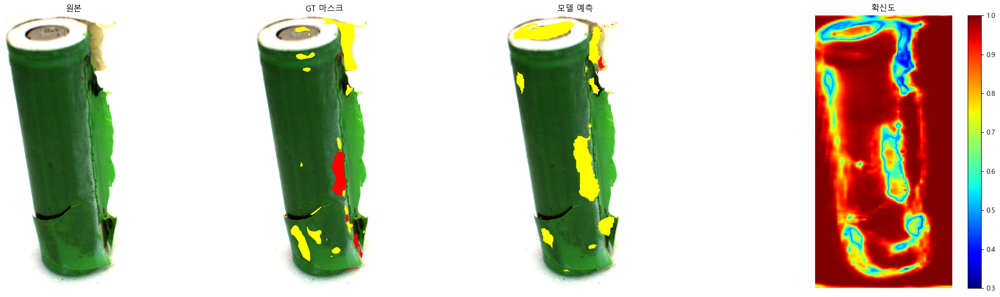
    


    
    [RGB_cell_cylindrical_0920_061] 라벨=both  GT: P=22480px D=22676px  모델: P=59064px D=3043px
    


    
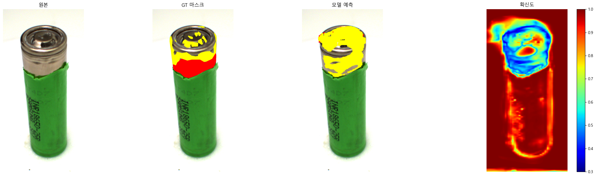
    


    
    [RGB_cell_cylindrical_0781_050] 라벨=pollution  GT: P=472px D=0px  모델: P=401px D=3423px
    


    
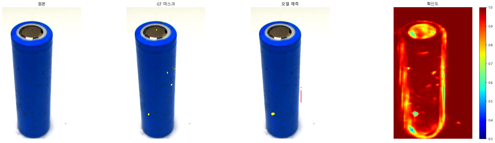
    


    
    [RGB_cell_cylindrical_0731_017] 라벨=pollution  GT: P=21508px D=0px  모델: P=8711px D=4659px
    


    
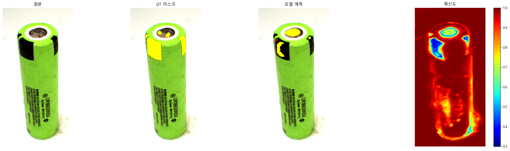
    


    
    [RGB_cell_cylindrical_0913_223] 라벨=pollution  GT: P=7098px D=0px  모델: P=11590px D=3047px
    


    
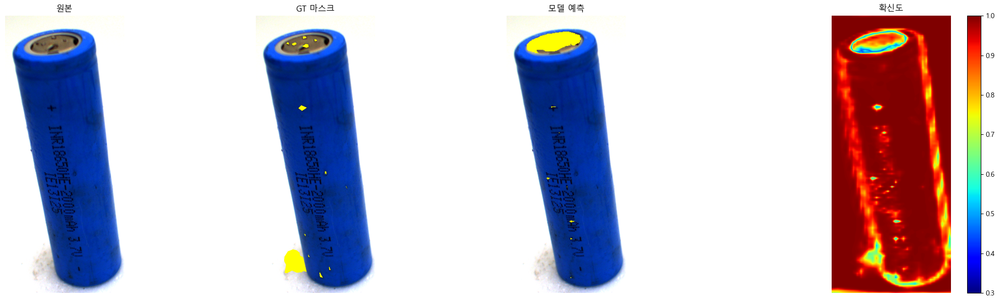
    


    
    [RGB_cell_cylindrical_0731_240] 라벨=pollution  GT: P=5797px D=0px  모델: P=6832px D=3248px
    


    
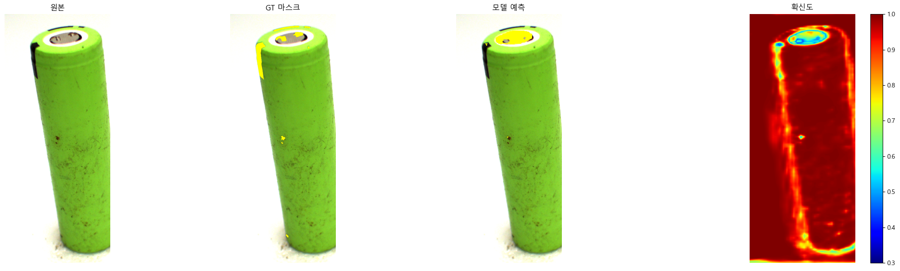
    


    
    [RGB_cell_cylindrical_0917_121] 라벨=both  GT: P=11224px D=34440px  모델: P=52708px D=1026px
    


    
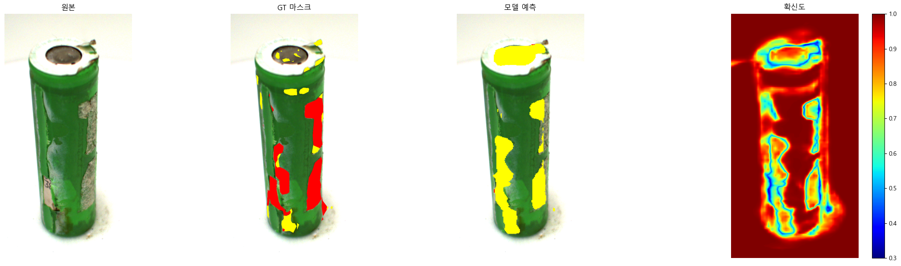
    


    
    [RGB_cell_cylindrical_0748_080] 라벨=pollution  GT: P=5019px D=0px  모델: P=16015px D=3497px
    


    
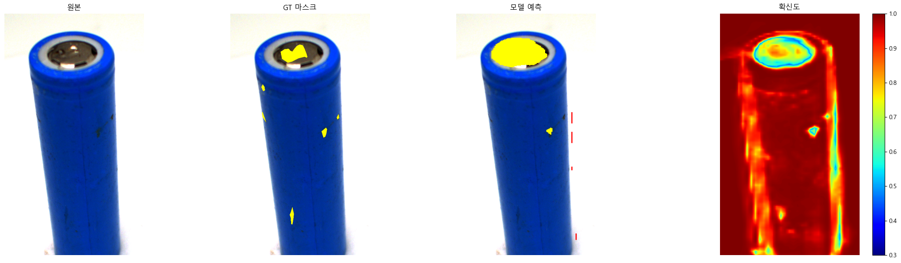
    


    
    [RGB_cell_cylindrical_0832_265] 라벨=pollution  GT: P=32241px D=0px  모델: P=43118px D=2800px
    


    
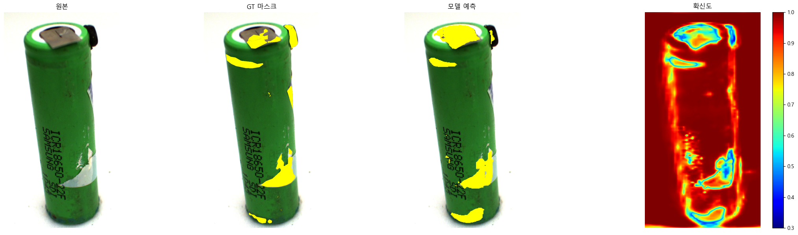
    


    
    [RGB_cell_cylindrical_0891_174] 라벨=both  GT: P=17015px D=3690px  모델: P=19989px D=3520px
    


    
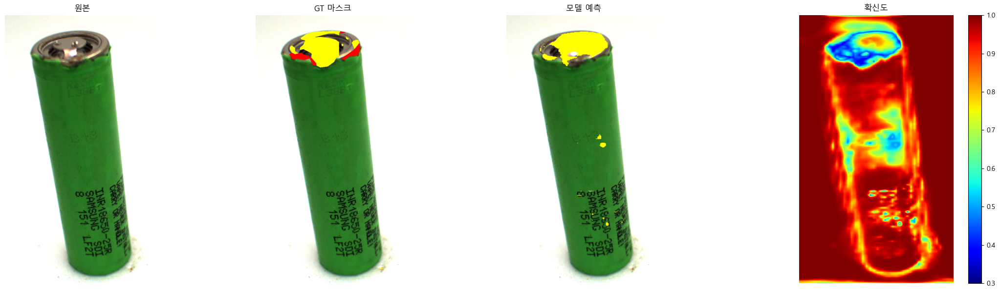
    


    
    [RGB_cell_cylindrical_0791_220] 라벨=both  GT: P=2017px D=7px  모델: P=22027px D=2985px
    


    
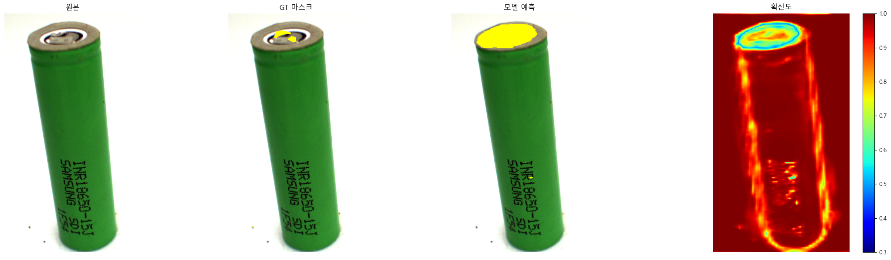
    


    
    [RGB_cell_cylindrical_0916_193] 라벨=both  GT: P=131074px D=9730px  모델: P=125199px D=2107px
    


    
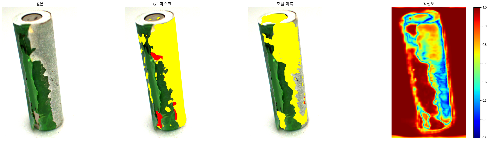
    


    
    [RGB_cell_cylindrical_0851_267] 라벨=both  GT: P=7193px D=230px  모델: P=37482px D=46936px
    


    
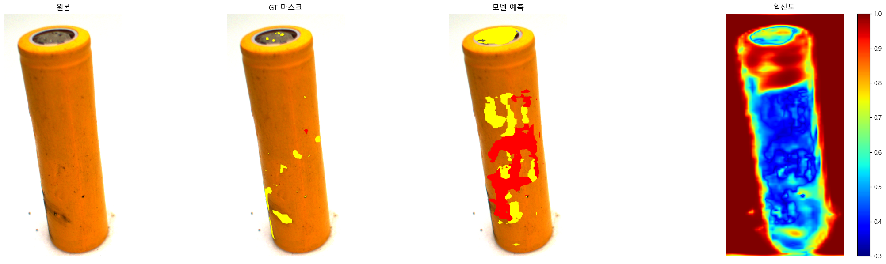
    


    
    [RGB_cell_cylindrical_0821_134] 라벨=pollution  GT: P=2575px D=0px  모델: P=13423px D=3116px
    


    
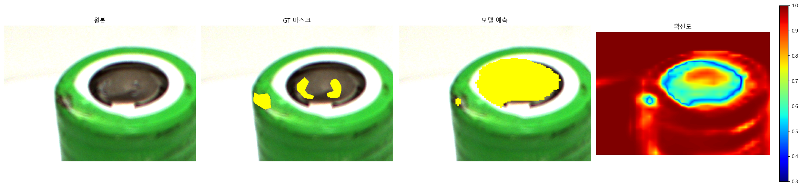
    


    
    ========== 정상품 과검 검증 : 22장 ==========
    
    [RGB_cell_cylindrical_1014_296] 라벨=clean  GT: P=0px D=0px  모델: P=923px D=2112px
    


    
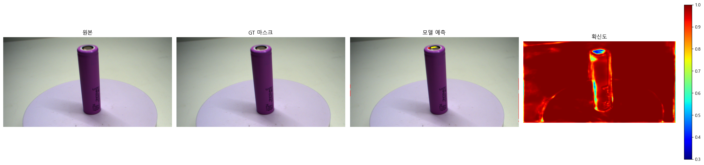
    


    
    [RGB_cell_cylindrical_0944_232] 라벨=clean  GT: P=0px D=0px  모델: P=684px D=1194px
    


    
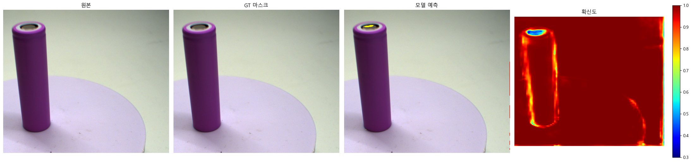
    


    
    [RGB_cell_cylindrical_0921_027] 라벨=clean  GT: P=0px D=0px  모델: P=2794px D=863px
    


    
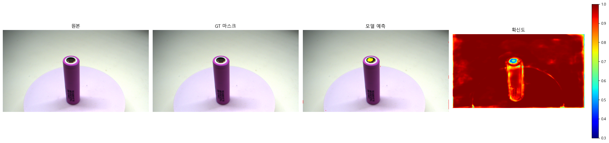
    


    
    [RGB_cell_cylindrical_1156_275] 라벨=clean  GT: P=0px D=0px  모델: P=7088px D=1235px
    


    
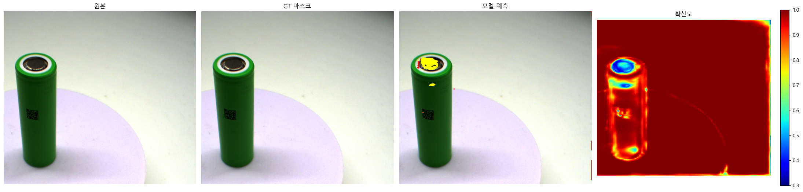
    


    
    [RGB_cell_cylindrical_1015_254] 라벨=clean  GT: P=0px D=0px  모델: P=1077px D=1579px
    


    

    


    
    [RGB_cell_cylindrical_0954_143] 라벨=clean  GT: P=0px D=0px  모델: P=2136px D=1221px
    


    

    


    
    [RGB_cell_cylindrical_0940_230] 라벨=clean  GT: P=0px D=0px  모델: P=579px D=636px
    


    
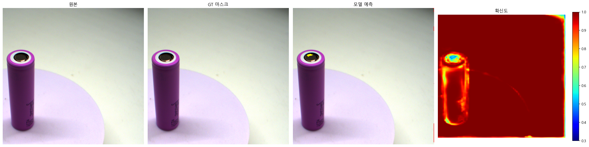
    


    
    [RGB_cell_cylindrical_0921_257] 라벨=clean  GT: P=0px D=0px  모델: P=1041px D=1479px
    


    

    


    
    [RGB_cell_cylindrical_0974_253] 라벨=clean  GT: P=0px D=0px  모델: P=2388px D=1097px
    


    
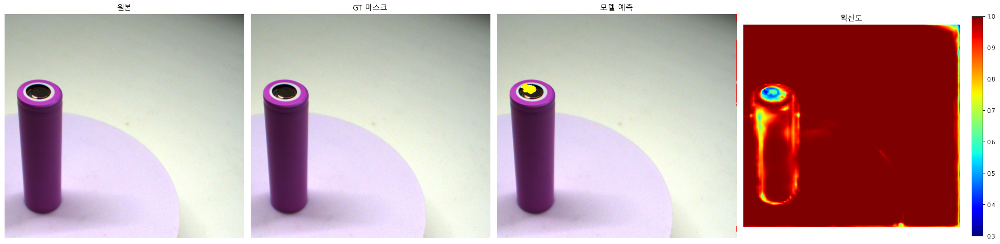
    


    
    [RGB_cell_cylindrical_1156_267] 라벨=clean  GT: P=0px D=0px  모델: P=3938px D=1079px
    


    

    


    
    [RGB_cell_cylindrical_1156_249] 라벨=clean  GT: P=0px D=0px  모델: P=582px D=2579px
    


    
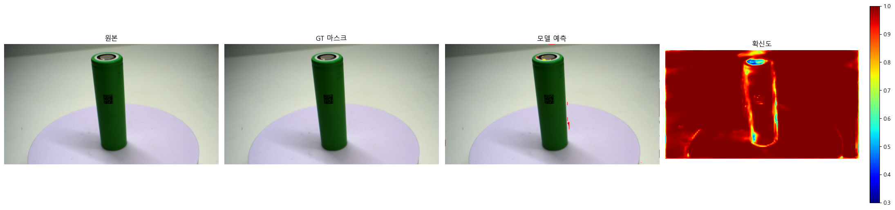
    


    
    [RGB_cell_cylindrical_0942_076] 라벨=clean  GT: P=0px D=0px  모델: P=1517px D=1127px
    


    
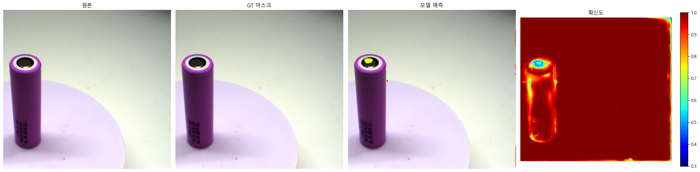
    


    
    [RGB_cell_cylindrical_0960_151] 라벨=clean  GT: P=0px D=0px  모델: P=1358px D=1126px
    


    
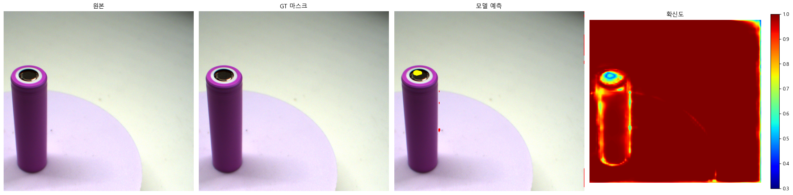
    


    
    [RGB_cell_cylindrical_0953_265] 라벨=clean  GT: P=0px D=0px  모델: P=2077px D=721px
    


    

    


    
    [RGB_cell_cylindrical_0995_132] 라벨=clean  GT: P=0px D=0px  모델: P=1008px D=1264px
    


    
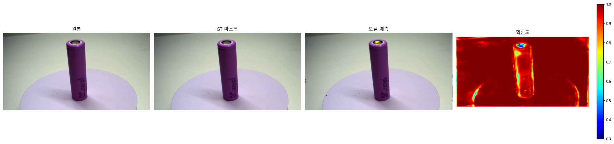
    


    
    [RGB_cell_cylindrical_0988_125] 라벨=clean  GT: P=0px D=0px  모델: P=1450px D=1253px
    


    
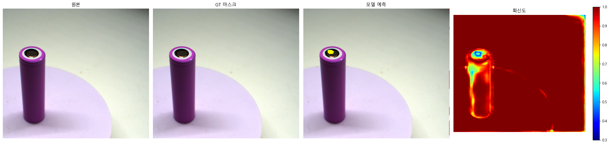
    


    
    [RGB_cell_cylindrical_0926_287] 라벨=clean  GT: P=0px D=0px  모델: P=2833px D=657px
    


    
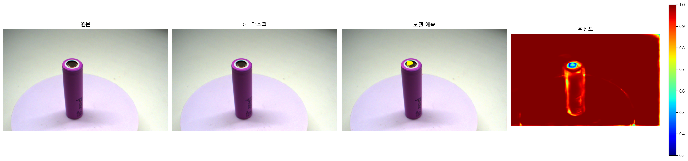
    


    
    [RGB_cell_cylindrical_1017_241] 라벨=clean  GT: P=0px D=0px  모델: P=1179px D=3799px
    


    
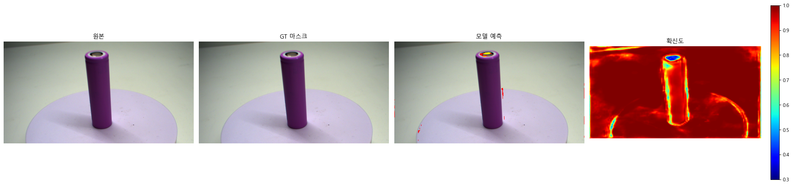
    


    
    [RGB_cell_cylindrical_0996_020] 라벨=clean  GT: P=0px D=0px  모델: P=739px D=1680px
    


    
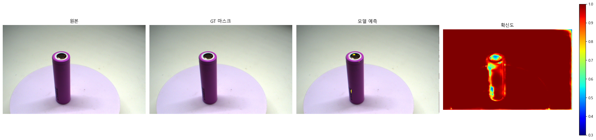
    


    
    [RGB_cell_cylindrical_1154_284] 라벨=clean  GT: P=0px D=0px  모델: P=7591px D=1654px
    


    
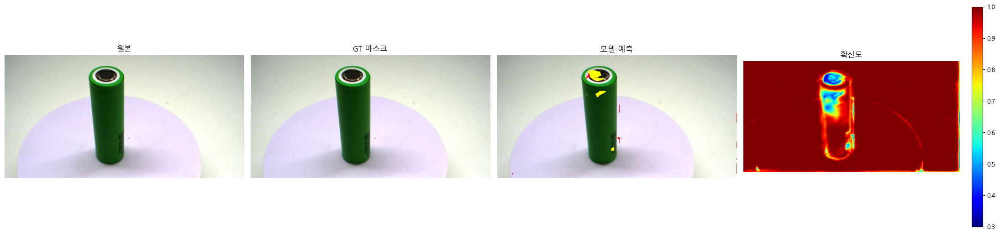
    


    
    [RGB_cell_cylindrical_1155_099] 라벨=clean  GT: P=0px D=0px  모델: P=5233px D=987px
    


    

    


    
    [RGB_cell_cylindrical_1154_187] 라벨=clean  GT: P=0px D=0px  모델: P=7183px D=424px
    


    
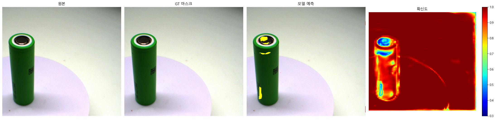
    


```python
gt_verdict = {
      # 'RGB_cell_cylindrical_0916_293': 'GT정상', '모델 예측 비정상 : GT 마스크는 빨간색 오염도 있지만 모델 예측은 노란색만 판단.'
      # 'RGB_cell_cylindrical_0920_061': 'GT정상','모델 예측 비정상 : GT 마스크보다 더 많은 부분. 특히나 위쪽을 NG로 판단, 또한 GT 에서 빨간색 범위가 좀 좁고 노란색 예측범위를 위쪽 가득 채우게 됨'
	# 'RGB_cell_cylindrical_0781_050' : 'GT정상','모델 예측 비정상 : GT 마스크와 비슷한데 모델 예측에는 빨간색 판단이 있습니다.'
	# 'RGB_cell_cylindrical_0731_017' : 'GT정상','모델 예측 비정상 : GT 마스크보다 적은 부분을 판단. 위쪽은 GT 마스크 양보다 크게 판단, 옆면(검정색. 테이프) 부분은 적게 판단'
	# 'RGB_cell_cylindrical_0913_223' : 'GT정상','모델 예측 비정상 : GT 마스크보다 더 많은 부분. 그래도 텍스트(배터리 이름) 오검은 사라짐'
	# 'RGB_cell_cylindrical_0731_240' : 'GT정상','모델 예측 비정상 : GT 마스크보다 더 많은 윗부분 오류 판단. 그리고 옆면(검정색, 테이프)는 오류 검출 못함'
	# 'RGB_cell_cylindrical_0917_121' : 'GT정상','모델 예측 비정상 : GT 마스크보다 더 많은 부분. 특히나 위쪽을 노란색 NG 로 판단. 측면은 GT 는 빨간색 검사도 했는데 모델 예측은 빨간색 검출을 아예 못함'
	# 'RGB_cell_cylindrical_0748_080' : 'GT정상','모델 예측 비정상 : GT 마스크보다 더 많은 부분. 특히나 위쪽을 노란색 NG 로 판단. GT 마스크에서 측면은 빨간색 검출이 없는데 모델은 약하게 빨간색으로도 예측'
	# 'RGB_cell_cylindrical_0832_265' : 'GT정상','모델 예측 비정상 : 그래도 GT 마스크와 가장 비슷하지만 옆면(검정색, 테이프) 는 모델 예측이 잘 못함'
	# 'RGB_cell_cylindrical_0891_174' : 'GT정상','모델 예측 비정상 : GT 마스크보다 더 많은 부분. 특히나 위쪽을 노란색 NG 로 판단. GT 마스크에는 빨간색 부분이 있는데 모델 예측은 빨간색 예측이 없음'
	# 'RGB_cell_cylindrical_0791_220' : 'GT정상','모델 예측 비정상 : GT 마스크보다 더 많은 부분. 특히나 위쪽을 노란색 NG 로 판단'
	# 'RGB_cell_cylindrical_0916_193' : 'GT정상','모델 예측 비정상 : GT 마스크보다 더 많은 부분. 특히나 위쪽을 노란색 NG 로 판단. GT 마스크에서 측면부 빨간색 검출이 있는데 모델은 노란색으로만 예측'
	# 'RGB_cell_cylindrical_0851_267' : 'GT정상','모델 예측 비정상 : GT 마스크보다 더 많은 부분. 특히나 위쪽을 노란색 NG 로 판단. 옆면은 GT 마스크에서 빨간색 검출이 거의 적은데 모델은 빨간색으로도 예측 '
	# 'RGB_cell_cylindrical_0821_134' : 'GT정상','모델 예측 비정상 : GT 마스크보다 더 많은 부분. 특히나 위쪽을 노란색 NG 로 판단. '

# 정상품 과검 검증

	# 'RGB_cell_cylindrical_1014_296' : 'GT정상','모델 예측 비정상 : 캔 위쪽을 빨간색 노란색으로 적게 예측'
	# 'RGB_cell_cylindrical_0954_143' : 'GT정상','모델 예측 비정상 : 캔 위쪽은 빨간색 노란색으로 적게 예측'
	# 'RGB_cell_cylindrical_0921_257' : 'GT정상','모델 예측 비정상 : 캔 위쪽은 노란색으로 적게 예측'
	# 'RGB_cell_cylindrical_0974_253' : 'GT정상','모델 예측 비정상 : 캔 위쪽 측면은 빨간색 노란색으로 예측'
	# 'RGB_cell_cylindrical_1156_267' : 'GT정상','모델 예측 비정상 :캔 위쪽은 빨간색 노란색으로 예측 배경을 빨간색으로 예측'
	# 'RGB_cell_cylindrical_1156_249' : 'GT정상','모델 예측 비정상 : 캔 위쪽 노란색 측면(글자부분)은 노란색으로 예측'
	# 'RGB_cell_cylindrical_0960_151' : 'GT정상','모델 예측 비정상 : 캔 위쪽 측면은 노란색으로 적게 예측'
	# 'RGB_cell_cylindrical_0988_125' : 'GT정상','모델 예측 비정상 : 캔 위쪽 측면은 노란색으로 적게 예측'
	# 'RGB_cell_cylindrical_1017_241' : 'GT정상','모델 예측 비정상 :캔 위쪽 측면은 노란색으로 적게 예측'
	# 'RGB_cell_cylindrical_0996_020' : 'GT정상','모델 예측 비정상 : 캔 위쪽 측면은 노란색 빨간색으로 예측'
	# 'RGB_cell_cylindrical_0996_020' : 'GT정상','모델 예측 비정상 : 캔 위쪽 측면은 노란색 빨간색으로 예측'
	# 'RGB_cell_cylindrical_1156_249' : 'GT정상','모델 예측 비정상 : 캔 위쪽은 빨간색 노란색으로 예측 배경을 빨간색으로 예측'
	# 'RGB_cell_cylindrical_0942_076' : 'GT정상','모델 예측 비정상 : 캔 위쪽 측면은 노란색으로 적게 예측'
	# 'RGB_cell_cylindrical_0960_151' : 'GT정상','모델 예측 비정상 : 캔 위쪽 측면은 노란색으로 적게 예측'
	# 'RGB_cell_cylindrical_0953_2651' : 'GT정상','모델 예측 비정상 : 캔 위쪽 측면은 노란색으로 적게 예측'
	# 'RGB_cell_cylindrical_0995_132' : 'GT정상','모델 예측 비정상 : 캔 위쪽 측면은 노란색으로 적게 예측'
	# 'RGB_cell_cylindrical_0988_125' : 'GT정상','모델 예측 비정상 : 캔 위쪽 측면은 노란색으로 적게 예측'
	# 'RGB_cell_cylindrical_0926_287' : 'GT정상','모델 예측 비정상 : 캔 위쪽 측면은 노란색으로 적게 예측'
	# 'RGB_cell_cylindrical_1017_241' : 'GT정상','모델 예측 비정상 : 캔 위쪽은 빨간색 노란색으로 예측 배경을 빨간색으로 예측'
	# 'RGB_cell_cylindrical_0996_020' : 'GT정상','모델 예측 비정상 : 캔 위쪽 측면은 노란색으로 적게 예측'
	# 'RGB_cell_cylindrical_1154_284' : 'GT정상','모델 예측 비정상 : 캔 위쪽은 빨간색 노란색으로 예측 배경을 빨간색으로 예측'
	# 'RGB_cell_cylindrical_1155_099' : 'GT정상','모델 예측 비정상 : 캔 위쪽 측면은 노란색으로 적게 예측'
	# 'RGB_cell_cylindrical_1154_187' : 'GT정상','모델 예측 비정상 : 캔 위쪽 노란색 측면(글자부분)은 노란색으로 예측'
    # v1 때보다 정상품을 과검하는 경우가 더 늘었습니다.
  }
```

## 5. 검증 종합 및 다음 단계

### 5-1. v2 검증 요약

`battery_deeplab_v2.onnx`(20배 상한·CE 재학습)를 test 셋 38장(정상품 24 + 결함 14)으로 전수 검증한 결과는
다음과 같습니다.

| 클래스 | v1 대비 변화 | 판정 |
|---|---|---|
| Pollution(노랑) | Precision 0.048 → 0.432, 예측 면적이 GT와 같은 자릿수로 수렴 | **실질 개선** |
| Damaged(빨강) | 실제 결함과 무관하게 전 이미지에 노이즈성 예측 | **학습 실패** |

- **Pollution은 개선되었습니다.** `0916_193`(GT 131,074px / 모델 125,199px), `0891_174`(GT 17,015px / 모델
19,989px) 등 예측 면적이 GT와 동일 자릿수로 수렴하여, v1의 핵심 문제였던 과예측 편향이 상당 부분
완화되었습니다.

- **Damaged는 학습에 실패하였습니다.** 정상품·결함품을 가리지 않고 모든 이미지에서 약 400~4,700px의 빨간색
예측이 일정하게 발생하였으며, 이는 실제 결함이 아닌 노이즈 수준의 출력입니다. 반대로 빨간색 결함이 실제로
많은 이미지에서는 오히려 검출하지 못하였습니다 (`0917_121` GT D=34,440px → 모델 1,026px / `0920_061` GT
D=22,676px → 모델 3,043px). 즉 Damaged 예측은 이미지 내용과 상관관계가 없습니다.

### 5-2. Damaged 학습 실패 원인

- 학습 데이터에서 Damaged 픽셀 비율은 **0.12%**로 Pollution(0.45%)보다 약 3.6배 희소합니다.
- 그러나 재학습 시 적용한 가중치 상한(`MAX_RATIO=20`)으로 인해 Pollution과 Damaged의 클래스 가중치가
1.46으로 **동일**해졌습니다. 상한이 Damaged의 희소성 보정을 상쇄하여, 더 큰 가중치가 필요했던 빨간색
클래스가 충분히 학습되지 못하였습니다.
- decoder만 학습(전체 파라미터의 3.2%)하는 구조와 극소량의 빨간색 학습 표본도 함께 작용한 결과입니다.

### 5-3. 다음 단계 — 2-class 재학습

3-class 체계에서 클래스 가중치(30배 → 5배 → 20배, 3회)를 조정하는 접근은 한계에 도달하였습니다. Damaged는
0.12%의 데이터만으로는 본 파이프라인에서 안정적으로 학습되기 어렵습니다.

따라서 다음 노트북에서는 클래스 체계를 **2-class(배경 / 결함)** 로 단순화하여 재학습합니다.

- 마스크에서 Pollution과 Damaged를 단일 '결함' 클래스로 병합 → 결함 픽셀 비율이 0.12% + 0.45% = **0.57%**로
합쳐져, 빨간색 단독 희소성 문제가 구조적으로 해소됩니다.
- 결함 종류 구분은 포기하되, **결함 유무 판정의 신뢰도**를 우선 확보합니다. 검사 공정에서 1차 목표는
정상/불량 선별이므로 타당한 설계 선택입니다.
- 학습·평가 조건(backbone·ASPP freeze, 30 epoch, 가중치 상한 20배 등)은 v2와 동일하게 유지하여, 클래스 체계
변경의 효과만 분리해 확인합니다.

> 다음 노트북: `10_re_finetune_v3_colab.ipynb` — 2-class 체계로 재학습 후, ONNX
변환(`battery_deeplab_v3.onnx`) 및 본 노트북 기준의 재검증을 진행합니다.
